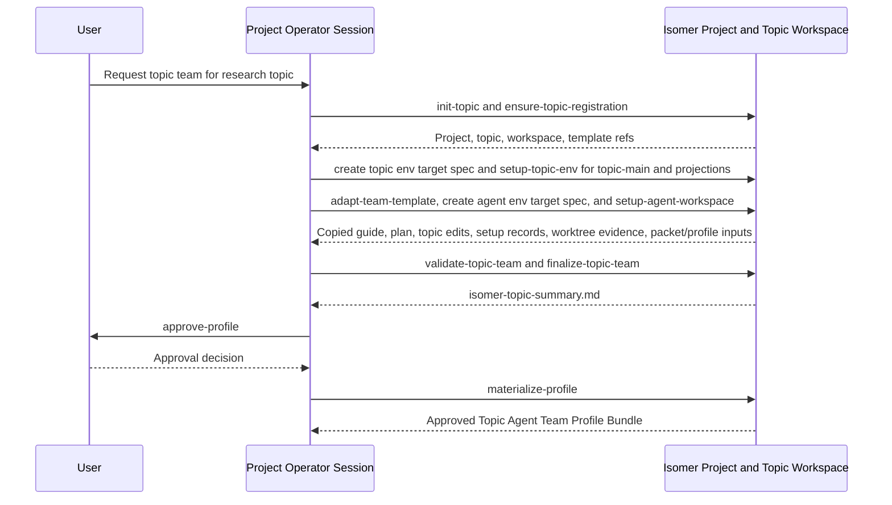
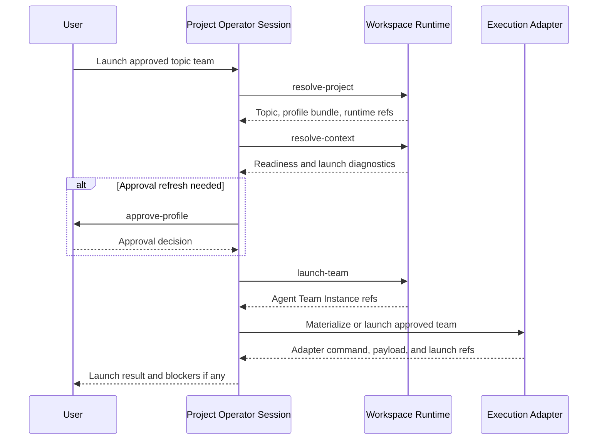

# Operator Admin Skills

This subtree contains skills intended for Project Operator Sessions and Operator Agents. Operator skills use the `isomer-admin-<purpose>` naming convention because they operate project control surfaces: project discovery, topic creation, compatibility common topic preparation, human-orchestrated Topic Actor research, Topic Team Specialization orchestration, approval provenance, profile materialization, and team launch orchestration.

Install these skills into the agent surface that acts as the Project Operator Session or durable Operator Agent. Ordinary research team members should use research-stage skills from `skillset/research-paradigm/`; Service Team actors should use service skills from `skillset/service/`.

## Skill Purposes

| Skill | Purpose |
| --- | --- |
| `isomer-admin-project-mgr` | Run the operator Project lifecycle workflow. It exposes short local subcommands such as `help`, `init-project`, `check-project`, `list-topics`, `show-context`, `init-runtime`, `prep-runtime`, `prepare-topic`, `manual-research`, and `specialize-team`; it initializes `.isomer-labs/` and the Isomer-managed `.isomer-labs/.houmao/` overlay through `isomer-cli project init`, checks Project health, resolves context, prepares runtime, routes blank-state topic creation and manual-research setup to `isomer-admin-topic-creator`, and hands full topic-team specialization to `isomer-admin-topic-team-specialize fast-forward`. |
| `isomer-admin-topic-creator` | Create or resume a Research Topic from empty or partial Project state to a manual-research-ready Topic Workspace. It exposes commands such as `help`, `plan`, `create`, `ensure-project`, `define-topic`, `register-topic`, `init-runtime`, `setup-topic-env`, `setup-actors`, `bootstrap-research`, `start-manual-research`, `status`, and `repair`; it delegates Project lifecycle to `isomer-admin-project-mgr`, topic environment setup to `isomer-srv-topic-env-setup`, Topic Actor topology to `isomer-admin-topic-workspace-mgr`, v2 research bootstrap to `isomer-rsch-workspace-mgr-v2`, and compatibility start-pack finalization to `isomer-admin-manual-research-session`. |
| `isomer-admin-topic-prepare` | Deprecated for direct user invocation. Use `isomer-admin-topic-creator` for end-to-end topic initialization. This skill remains available for compatibility and delegated common-preparation steps before manual research or team specialization. |
| `isomer-admin-manual-research-session` | Deprecated for direct user invocation. Use `isomer-admin-topic-creator create` or `isomer-admin-topic-creator start-manual-research` for manual-research-ready topic setup. This skill remains available for compatibility and delegated start-pack finalization. |
| `isomer-admin-topic-team-specialize` | Run the module-level Topic Team Specialization workflow. It exposes procedural subcommands from `init-topic` through `finalize-topic-team`, five helper subcommands for lower-level specialization work, and misc commands such as `help`, `step-by-step`, and `fast-forward`; it creates `topic.intent.overview`, resolves topic and agent environment intent, creates or validates derived topic and agent target specs, copies and adapts Domain Agent Team Template material under `<topic-workspace>/team-profile/`, orchestrates Topic Workspace predecessor setup through service skills, delegates per-agent worktree and cwd proof to agent env setup when requested, validates readiness, writes `isomer-topic-summary.md`, and keeps approval, materialization, and launch as explicit boundaries. |
| `isomer-admin-topic-workspace-mgr` | Inspect, validate, and summarize optional Git-backed Topic Workspace topology. It reports semantic labels, Topic Main Development Repository state, projection roots, branch namespace, Topic Actor Workspace state, Agent Workspace worktree state, derived compatibility refs, `records/*` visibility diagnostics, advisory Workspace Boundary notes, blockers, and next actions. It owns Topic Actor CRUD, Topic Actor Workspace materialization or repair, actor-scoped path diagnostics, and `project topic-actors ...` guidance. Canonical Topic Main Development Repository setup belongs to `isomer-srv-topic-env-setup`; canonical per-agent worktree creation and cwd proof belong to `isomer-srv-agent-env-setup`. |
| `isomer-admin-houmao-interop` | Bridge Isomer Labs project constructs and the Houmao agent runtime. It explains how the Houmao agent loop works, lists agent-loop customization points, maps Domain Agent Team Templates such as DeepScientist onto Houmao concepts, and guides runtime inspection. Use it when a topic-team specialization or launch task touches Houmao loop, roles, recipes, presets, specialists, launch dossiers, project overlays, credentials, mailbox, or gateway. |

## Example: Initialize and Check a Project

Use this flow when a user asks the operator to create, diagnose, or prepare an Isomer Project before topic-team work.

1. The operator can ask `isomer-admin-project-mgr init-project` to run the supported Project bootstrap path. Successful `isomer-cli project init` creates `.isomer-labs/`, the selected generated content root, and the Isomer-managed `.isomer-labs/.houmao/` overlay. Root `.houmao/` is external user-owned Houmao state if present. Research Topics and Topic Workspaces are created later through `isomer-cli project topics create`.
2. If the user wants usage information, call `isomer-admin-project-mgr help`; invoking `isomer-admin-project-mgr` without a prompt defaults to the same help output.
3. If the Project already exists, call `check-project` to run read-only Project validation, doctor diagnostics, and Houmao Project status checks.
4. Use `list-topics` and `show-context` to inspect registered Research Topics, Topic Workspaces, defaults, selected profile refs, and selected template refs.
5. Use `init-runtime` and `prep-runtime` only when the user explicitly wants Workspace Runtime state and launch-facing readiness.
6. When the user asks to create, prepare, or start a Research Topic for manual or future research work, call `isomer-admin-topic-creator plan` or `isomer-admin-topic-creator create`; it handles the ladder from Project readiness through manual-research start packs and delegates lower-level operations.
7. When the user asks for a narrow Project-only route, `prepare-topic` and `manual-research` now hand off to `isomer-admin-topic-creator` unless an advanced operator explicitly requests deprecated compatibility behavior.
8. When the user asks to specialize a Domain Agent Team Template over a Research Topic, call `specialize-team`; it resolves Project context and hands off to `isomer-admin-topic-team-specialize fast-forward` rather than to the internal `adapt-team-template` stage.

## Example: Prepare Human-Orchestrated Topic Actor Research

Use this flow when a user wants to do research manually or with multiple manually controlled agents without first launching a formal Topic Agent Team.

1. Call `isomer-admin-topic-creator plan` for a dry-run ladder report or `isomer-admin-topic-creator create` when the user has approved mutation.
2. The creator ensures or delegates Project initialization, topic definition, Research Topic and Topic Workspace registration, Workspace Runtime readiness, topic environment setup, and `topic.repos.main` readiness.
3. The creator creates or reuses the default reserved `operator` Topic Actor Workspace unless the user explicitly opts out, and it sets up additional requested actors such as `claude-scout`, `codex-exp-a`, or `houmao-writer-a`.
4. The creator delegates actor registration, materialization, repair, and diagnostics to `isomer-admin-topic-workspace-mgr` through `project topic-actors ...`.
5. The creator runs `isomer-rsch-workspace-mgr-v2` so v2 skills have base topic readiness, Topic Actor readiness, optional formal team readiness, and placeholder-binding guidance.
6. The creator gives each manually controlled worker its own `topic.actors.workspace` cwd and a start-pack record. `topic.repos.main` remains the Git anchor and integration surface, not the required shared cwd for every worker.

## Example: Specialize a Domain Team for a New Topic

Use this flow when a user gives a research topic and asks the operator to instantiate a topic-level team from a Domain Agent Team Template such as `deepsci-mini`.

1. The operator can ask `isomer-admin-topic-team-specialize init-topic` to turn a new research topic idea into `topic.intent.overview` at the resolved Topic Workspace intent path. If the topic already exists in the Project Manifest, the skill can use the registered Research Topic and Topic Workspace instead.
2. If the user wants usage information, call `isomer-admin-topic-team-specialize help`; invoking `isomer-admin-topic-team-specialize` without a prompt defaults to the same help output.
3. The normal procedural flow is `resolve-project`, `resolve-topic-intent`, `ensure-topic-registration`, `resolve-topic-env-gate`, create or validate `topic.env.topic_setup_target_spec`, `setup-topic-env`, `adapt-team-template`, optional `clarify-topic-team`, `resolve-agent-env-gate`, create or validate `topic.env.agent_setup_target_spec`, `setup-agent-workspace`, `validate-topic-team`, and `finalize-topic-team`. Direct requests like `specialize <team-path> over topic <topic>` route to `fast-forward`, which runs this path automatically where possible. `finalize-topic-team` writes `isomer-topic-summary.md` with the topic team, goal, working logic, environment setup, Agent Workspace layout, validation status, blockers, and next actions.
4. If the user wants guided specialization, call `step-by-step`; it follows the same required path as `fast-forward` but explains each step and waits for user confirmation before continuing.
5. If the user wants manual lower-level work, call one helper subcommand at a time, such as `resolve-project`, `inspect-template`, `resolve-context`, `map-placeholders`, or `draft-profile`.
6. If the user explicitly approves continuing past finalization, the same skill's local `approve-profile`, `materialize-profile`, and `launch-team` subcommands handle approval provenance, validated bundle writing, and launch-facing runtime or adapter work.
7. The operator reports topic overview path, copied material paths, packet/profile inputs, environment status, Agent Workspace paths, validation refs, summary path, and blockers.

For Topic Workspace environment setup, `setup-topic-env` creates or validates `topic.env.topic_setup_target_spec`, delegates to `isomer-srv-topic-env-setup`, and records Topic Workspace, Topic Main Development Repository, and projection predecessor evidence, not per-agent cwd proof. For Topic Actor Workspace setup, delegate Topic Actor registration, materialization, repair, archive, and actor-scoped diagnostics to `isomer-admin-topic-workspace-mgr`. For Agent Workspace setup, `setup-agent-workspace` creates or validates `topic.env.agent_setup_target_spec` and delegates per-agent worktree creation plus cwd proof to `isomer-srv-agent-env-setup` only after topic env predecessor evidence, Topic Main Development Repository predecessor evidence, required projection predecessor evidence, and authoritative Agent Names exist.

## Example: Launch an Approved Topic Team

Use this flow when a Topic Agent Team Profile Bundle already exists and the user asks the operator to create or launch the topic's runtime team.

1. `resolve-project` and `resolve-context` resolve the selected Research Topic, Topic Workspace, approved profile bundle, Workspace Runtime, and launch-relevant adapter refs.
2. The local `approve-profile` subcommand refreshes approval when the existing bundle has stale approval, unresolved launch blockers, or requires a fresh user decision before launch.
3. The local `launch-team` subcommand creates or selects the Agent Team Instance, preserves profile bundle and packet provenance, and routes adapter launch materialization.
4. The operator reports runtime refs, adapter refs, launch diagnostics, launch blockers, and the next operator action to the user.

## Example: Explain or Customize Houmao for a Topic Team

Use this flow when a topic-team specialization or launch task touches Houmao-managed agents.

1. If the user asks how the Houmao agent loop works, call `explain-loop`; it reports the gateway-driven request queue, the three daemon loops, the TUI-tracking lifecycle kernel, and the concrete source files.
2. If the user asks what to edit to customize the loop, call `customize-loop`; it reports agent-definition directory layout, project overlay concepts, loop packages, gateway/runtime config, and CLI commands.
3. If the user asks how a Domain Agent Team Template such as DeepScientist maps onto Houmao, call `map-template-to-houmao`; it explains the single-PI-agent stage-skill model and maps it to Houmao presets, launch profiles, and agent-facing skills.
4. If the user asks how to inspect a running agent, gateway, mailbox, or runtime state, call `inspect-runtime`; it reports CLI commands, filesystem paths, and passive API endpoints.
5. Preserve the guardrails: keep Houmao as the adapter/implementation layer, do not edit the Houmao source checkout for Isomer behavior, and do not launch from template source without an approved Topic Agent Team Profile Bundle.

## Naming Contract

Operator skill folders must be named `isomer-admin-<purpose>`, and `SKILL.md` frontmatter `name:` must match the folder name. If present, `agents/openai.yaml` must use the same skill name for `interface.display_name` and invoke the same skill in `interface.default_prompt`.

Operator skills must preserve Isomer domain boundaries. They can direct validation, approval, materialization, and launch orchestration, but they must not bypass Isomer validators, Gates, Workspace Runtime recording, or adapter preflight.

`isomer-admin-project-mgr` is the canonical entrypoint for Project lifecycle operations before topic work. It owns Project bootstrap, Project checks, topic and workspace listing, context inspection, runtime initialization, readiness preparation, and routing to topic creation, manual research setup, or formal topic-team adaptation.

`isomer-admin-topic-creator` is the canonical user-facing entrypoint for topic initialization. It owns the happy path from empty or partial Project state to manual-research-ready Topic Workspace and delegates lower-level mutation to the existing owner skills and CLI surfaces.

`isomer-admin-topic-prepare` is deprecated for direct user invocation and retained as a compatibility common topic-preparation boundary. It does not specialize a team or start research; it produces the topic state that both manual Topic Actor research and Topic Team Specialization can consume when delegated.

`isomer-admin-manual-research-session` is deprecated for direct user invocation and retained as the compatibility human-orchestrated Topic Actor research boundary. It does not own actor topology mutation, does not create formal team material, and does not fabricate Agent Instance refs.

`isomer-admin-topic-team-specialize` is the canonical entrypoint for Domain Agent Team Template understanding and topic adaptation. Its local subcommands are the normal implementation path. Do not add standalone operator skills for project awareness, template inspection, topic context resolution, placeholder reconciliation, topic profile drafting, profile review approval, profile materialization, or team launch orchestration unless a future OpenSpec change explicitly reverses the consolidation.

`isomer-admin-topic-workspace-mgr` is the entrypoint for Topic Workspace topology operations, including Topic Actor CRUD, Topic Actor Workspace materialization or repair, actor-scoped path diagnostics, Git-backed topology inspection, branch helper operations, Workspace Boundary summaries, manual compatibility operations, and legacy diagnostics. It is not the canonical creator of the Topic Main Development Repository or normal per-agent worktrees.

`isomer-admin-houmao-interop` is the canonical entrypoint for Houmao-specific explanation and customization questions that arise during topic-team work. It answers how the Houmao loop works and how Isomer templates map onto Houmao, but it does not replace `isomer-admin-topic-team-specialize` for full specialization workflows.
