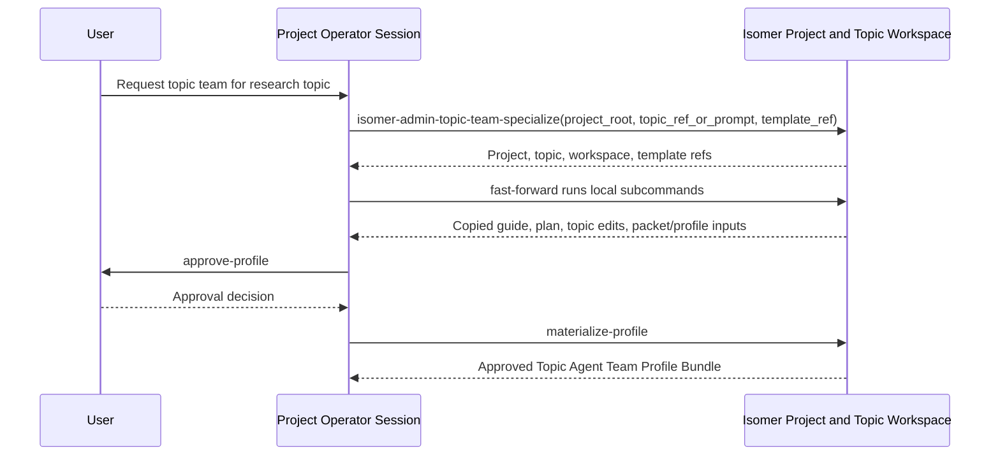
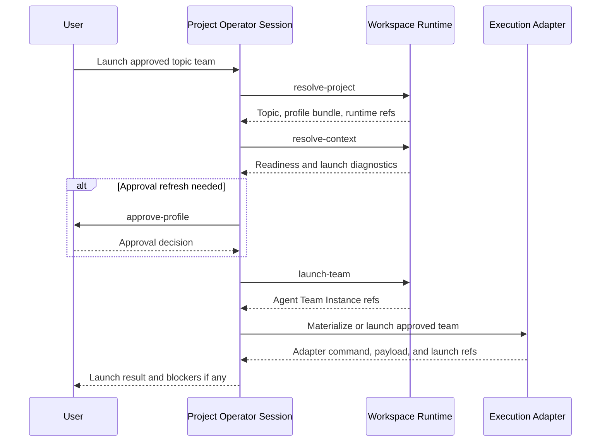

# Operator Admin Skills

This subtree contains skills intended for Project Operator Sessions and Operator Agents. Operator skills use the `isomer-admin-<purpose>` naming convention because they operate project control surfaces: project discovery, Topic Team Specialization orchestration, approval provenance, profile materialization, and team launch orchestration.

Install these skills into the agent surface that acts as the Project Operator Session or durable Operator Agent. Ordinary research team members should use research-stage skills from `skillset/research-paradigm/`; Service Team actors should use service skills from `skillset/service/`.

## Skill Purposes

| Skill | Purpose |
| --- | --- |
| `isomer-admin-topic-team-specialize` | Run the module-level Topic Team Specialization workflow. It exposes short local subcommands such as `resolve-project`, `inspect-template`, and `fast-forward`; it copies Domain Agent Team Template material into `<topic-workspace>/team-profile/`, reads or creates `team-specialization-guide.md`, creates `team-specialization-plan.md`, adapts copied material, records a `Final Report`, and reports packet/profile inputs. |

## Example: Specialize a Domain Team for a New Topic

Use this flow when a user gives a research topic and asks the operator to instantiate a topic-level team from a Domain Agent Team Template such as `deepsci-mini`.

1. `isomer-admin-topic-team-specialize fast-forward(project_root, topic_ref_or_prompt, template_ref)` uses local subcommands to resolve project and topic context, inspect the template, reconcile placeholders, copy template material into `<topic-workspace>/team-profile/`, read or create `team-specialization-guide.md`, create `team-specialization-plan.md`, adapt copied material, record a `Final Report`, and report Topic Team Instantiation Packet and Topic Agent Team Profile Bundle inputs.
2. If the user wants manual specialization, call one subcommand at a time, such as `resolve-project`, `inspect-template`, `resolve-context`, `map-placeholders`, or `draft-profile`.
3. If the user explicitly approves continuing past specialization, the same skill's local `approve-profile` and `materialize-profile` subcommands handle approval provenance and validated bundle writing.
4. The operator reports copied material paths, packet/profile inputs, approval or materialization status, validation refs, and blockers.

## Example: Launch an Approved Topic Team

Use this flow when a Topic Agent Team Profile Bundle already exists and the user asks the operator to create or launch the topic's runtime team.

1. `isomer-admin-topic-team-specialize resolve-project(project_root, topic_ref)` and `resolve-context` resolve the selected Research Topic, Topic Workspace, approved profile bundle, Workspace Runtime, and launch-relevant adapter refs.
2. The local `approve-profile` subcommand refreshes approval when the existing bundle has stale approval, unresolved launch blockers, or requires a fresh user decision before launch.
3. The local `launch-team` subcommand creates or selects the Agent Team Instance, preserves profile bundle and packet provenance, and routes adapter launch materialization.
4. The operator reports runtime refs, adapter refs, launch diagnostics, launch blockers, and the next operator action to the user.

## Naming Contract

Operator skill folders must be named `isomer-admin-<purpose>`, and `SKILL.md` frontmatter `name:` must match the folder name. If present, `agents/openai.yaml` must use the same skill name for `interface.display_name` and invoke the same skill in `interface.default_prompt`.

Operator skills must preserve Isomer domain boundaries. They can direct validation, approval, materialization, and launch orchestration, but they must not bypass Isomer validators, Gates, Workspace Runtime recording, or adapter preflight.

`isomer-admin-topic-team-specialize` is the canonical entrypoint for Domain Agent Team Template understanding and topic adaptation. Its local subcommands are the normal implementation path. Do not add standalone operator skills for project awareness, template inspection, topic context resolution, placeholder reconciliation, topic profile drafting, profile review approval, profile materialization, or team launch orchestration unless a future OpenSpec change explicitly reverses the consolidation.
