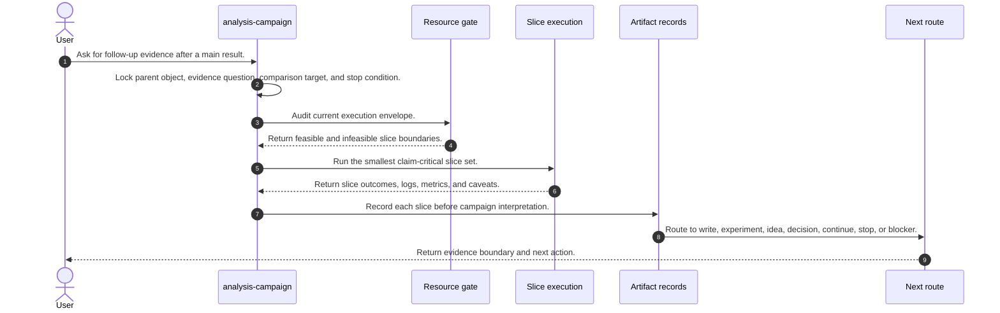
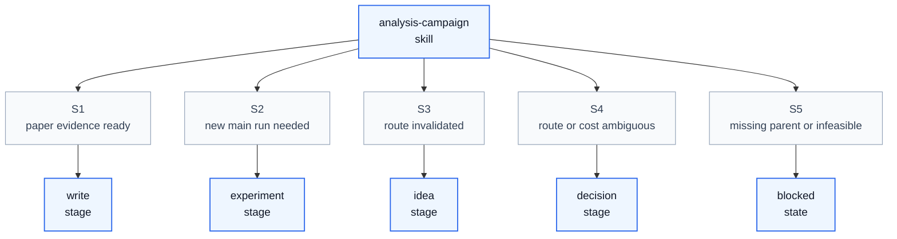

# Analysis Campaign Skill Process

## Purpose

This note explains how `analysis-campaign` operates as a skill process. It aligns `/home/huangzhe/workspace/code/isomer-labs/extern/orphan/DeepScientist/src/skills/analysis-campaign/SKILL.md`, its campaign-design, artifact-flow, boundary-case, plan, checklist, writing-facing-slice, and operational-guidance references, and the compact workflow report in `context/explore/deepscientist-skill-analysis/analysis-campaign.md`.

The key orchestration rule is: `analysis-campaign` owns bounded follow-up evidence after a parent result, records slice-level evidence before campaign-level claims, and stops when the parent claim boundary or next route is clear.

## Original Skill Directory Files

| File | What it is about |
| --- | --- |
| `SKILL.md` | Main `analysis-campaign` skill definition, follow-up evidence workflow, slice contract, comparability rules, writing-facing boundaries, artifact rules, and exit criteria. |
| `references/artifact-flow-examples.md` | Examples for one-slice, multi-slice, writing-facing, failed, infeasible, and read-only analysis flows. |
| `references/boundary-cases.md` | Edge cases for new-main-experiment confusion, non-comparable evidence, qualitative evidence, one-slice sufficiency, repeated failures, pre-outline writing, extra comparators, and ambiguity. |
| `references/campaign-checklist-template.md` | Analysis evidence checklist template covering identity, frontier, resource gate, evidence gate, comparability, paper or review gate, blockers, and closeout. |
| `references/campaign-design.md` | Campaign design guide for goal, priority order, slice classes, writing-facing policy, and resource-aware design gates. |
| `references/campaign-plan-template.md` | Analysis evidence record template covering objective, comparability boundary, slice frontier, assets, envelope, execution choice, interpretation boundary, paper mapping, and frontier. |
| `references/operational-guidance.md` | Operational guidance for artifact-backed tactics, resource gates, execution, monitoring, memory, and connector-facing campaign charts. |
| `references/writing-facing-slice-examples.md` | Examples of good and bad writing-facing todo items for paper-linked analysis slices. |

## Concepts

- **Parent Object**: The main run, selected idea, parent claim, paper gap, reviewer item, rebuttal item, failure mode, or route decision being tested.
- **Evidence Question**: The specific claim, failure mode, robustness concern, limitation, or decision that the campaign is meant to answer.
- **Execution Envelope**: The real CPU, GPU, memory, wall-clock, storage, dependency, queue, and service constraints that shape the slice set.
- **Slice**: One follow-up analysis unit with fixed intervention or inspection target, conditions, metric or observable, evidence path, claim update, comparability verdict, and next action.
- **Analysis Route**: The chosen campaign scale, such as `analysis-lite`, artifact-backed campaign, writing-facing campaign, review or rebuttal campaign, or failure-analysis route.
- **Writing-Facing Slice**: A slice that must map back to paper contract fields such as section, item, claim links, display target, or paper role.
- **Campaign Interpretation**: The aggregate result derived from recorded slice evidence, not from impression.

## High Level Process



## Skill Call Graph



| ID | Caller | Route | Callee | Calling condition |
| --- | --- | --- | --- | --- |
| S1 | `analysis-campaign` | paper evidence ready | `write` | Slice evidence supports manuscript or report work and is mapped to the paper contract when needed. |
| S2 | `analysis-campaign` | new main run needed | `experiment` | Follow-up evidence shows the parent result needs a new main experiment rather than more slices. |
| S3 | `analysis-campaign` | route invalidated | `idea` | The current direction is weakened, contradicted, or abandoned enough to require a new route. |
| S4 | `analysis-campaign` | route or cost ambiguous | `decision` | Evidence, resources, or user preference make the next step non-obvious. |
| S5 | `analysis-campaign` | missing parent or infeasible | blocked state | No credible parent object exists, the evidence question is underspecified, or required resources are unavailable. |

## Formal Skill Process

```python
@skill(
    name="analysis-campaign",
    description="Run bounded follow-up evidence slices after a main result.",
)
def run_analysis_campaign(user_request: str, parent_ref: str | None = None) -> StageResult:
    parent = agent_do(
        "Lock the parent object, evidence question, comparison target, and stop condition.",
        context={"user_request": user_request, "parent_ref": parent_ref},
        returns=StageResult,
    )
    if parent.status in {"blocked", "failed"}:
        # Condition matched when no parent result, claim, paper gap, or decision can anchor the slice.
        return parent

    envelope = agent_do(
        "Audit the real execution envelope and mark infeasible slices before planning the campaign.",
        context={"parent": parent},
        returns=StageResult,
    )
    route = agent_select(
        ["analysis_lite", "artifact_backed_campaign", "writing_facing_campaign", "review_rebuttal_campaign", "failure_analysis"],
        criterion="Choose the lightest route that can answer the parent evidence question honestly.",
        context={"parent": parent, "envelope": envelope},
    )
    slices = agent_do(
        "Define and run the smallest claim-critical slice set, preserving comparability and current resource limits.",
        context={"route": route, "parent": parent, "envelope": envelope},
        returns=StageResult,
    )
    if slices.status in {"blocked", "failed"}:
        # Condition matched when launched slices fail, become infeasible, or cannot produce evidence.
        return agent_do("Record blocked or failed slice outcomes and next best action.", context=slices, returns=StageResult)

    records = agent_do(
        "Record each launched slice with question, intervention, fixed conditions, evidence path, claim update, comparability verdict, and next action.",
        context={"slices": slices, "route": route},
        returns=StageResult,
    )
    interpretation = agent_do(
        "Aggregate only decision-relevant findings from recorded slices and preserve null, negative, partial, and contradictory evidence.",
        context={"records": records, "parent": parent},
        returns=StageResult,
    )
    next_route = agent_select(
        ["continue_campaign", "write", "experiment", "idea", "decision", "stop", "blocked"],
        criterion="Choose the next route from the changed, confirmed, weakened, or blocked parent claim boundary.",
        context={"interpretation": interpretation},
    )
    return agent_do(
        "Record the campaign-level interpretation and route to the selected next stage.",
        context={"interpretation": interpretation, "next_route": next_route},
        returns=StageResult,
    )
```

## Skill Process Explanation

- **Parent Lock.** The campaign cannot start from vague curiosity; every slice must map to a parent claim, result, paper gap, reviewer item, or route decision.
- **Resource Gate.** Slice design is conditioned on real compute, memory, runtime, storage, dependencies, queues, and service constraints.
- **Route And Slice Design.** The skill chooses the smallest analysis route and runs claim-critical slices first, marking infeasible slices explicitly.
- **Slice Recording.** Each launched evidence-bearing slice must leave a durable outcome before campaign-level interpretation.
- **Aggregation And Routing.** The skill reports stable support, partial support, contradiction, ambiguity, and skipped low-value slices, then routes to writing, experiment, idea, decision, continue, stop, or blocker.

## Evidence Handoffs

| Producing skill or stage | Evidence | Consuming stage |
| --- | --- | --- |
| Parent lock | Parent object, evidence question, comparison target, and stop condition. | Resource gate and slice design |
| Resource gate | Execution envelope and infeasible-slice boundaries. | Route and slice selection |
| Slice execution | Logs, metrics, qualitative artifacts, outputs, failures, and caveats. | Slice recording |
| Slice recording | Per-slice status, evidence path, claim update, comparability verdict, and next action. | Campaign interpretation |
| Campaign interpretation | Strengthened, weakened, narrowed, abandoned, ambiguous, or blocked parent claim boundary. | `write`, `experiment`, `idea`, `decision`, continue, stop, or blocker |
