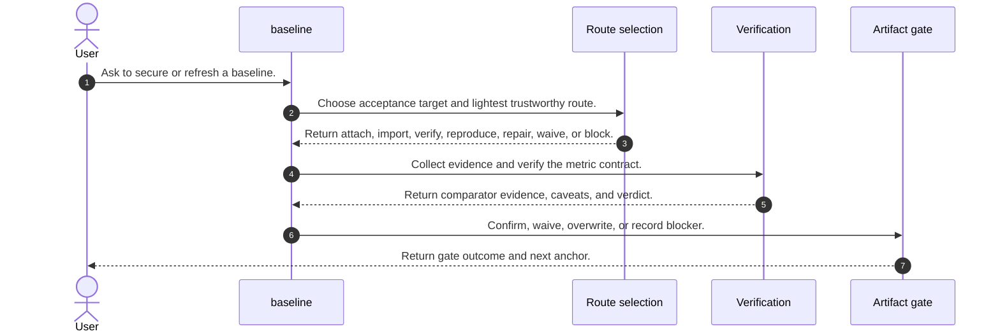
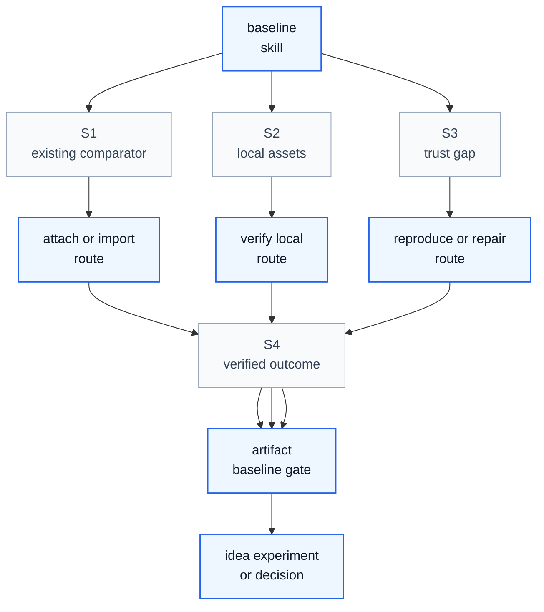

# Baseline Skill Process

## Purpose

This note explains how `baseline` operates as a skill process. It aligns `/home/huangzhe/workspace/code/isomer-labs/extern/orphan/DeepScientist/src/skills/baseline/SKILL.md`, its route-selection, comparability-contract, artifact-flow, payload, plan, checklist, boundary-case, and operational-guidance references, and the compact workflow report in `context/explore/deepscientist-skill-analysis/baseline.md`.

The key orchestration rule is: `baseline` owns the comparator gate and closes it only through verified evidence plus `artifact.confirm_baseline(...)`, `artifact.waive_baseline(...)`, `artifact.overwrite_baseline(...)`, or an explicit blocker.

## Original Skill Directory Files

| File | What it is about |
| --- | --- |
| `SKILL.md` | Main `baseline` skill definition, comparator-first workflow, acceptance targets, verification rules, artifact rules, and exit criteria. |
| `references/artifact-flow-examples.md` | Examples for attach, import, verify-local, publish, and waive baseline artifact flows. |
| `references/artifact-payload-examples.md` | Example payload shapes for route decisions and accepted baseline records. |
| `references/baseline-checklist-template.md` | Baseline gate checklist template covering identity, frontier, core gate, blockers, and closeout. |
| `references/baseline-plan-template.md` | Baseline route-record template for objective, contract, execution choice, acceptance boundary, and frontier. |
| `references/boundary-cases.md` | Edge cases for comparison-ready baselines, caveats, weak provenance, unclear local paths, route choices, and repeated failures. |
| `references/codebase-audit-checklist.md` | Checklist for minimum codebase audit coverage, implementation map, constraints, and baseline understanding. |
| `references/comparability-contract.md` | Compact comparability contract and verdict logic for baseline acceptance. |
| `references/operational-guidance.md` | Detailed tactics for route records, execution, environment handling, reuse, and memory. |
| `references/route-selection.md` | Decision rule and route meanings for attach, import, verify-local-existing, reproduce, repair, waive, and block. |

## Concepts

- **Comparator**: The source method, local service, package, trusted output, or reproduced run that later stages compare against.
- **Acceptance Target**: The trust level needed now, such as `comparison_ready`, `paper_repro_ready`, `registry_publishable`, `waived`, or `blocked`.
- **Lightest Route**: The cheapest route that can establish trust, chosen among attach, import, verify-local-existing, reproduce, or repair.
- **Metric Contract**: The accepted comparison contract, normally `<baseline_root>/json/metric_contract.json`, covering task, dataset, split, evaluation path, metric ids, directions, source identity, and deviations.
- **Verification Verdict**: A classification such as `verified_match`, `verified_close`, `verified_diverged`, `trusted_with_caveats`, or `broken`.
- **Baseline Gate**: The downstream permission boundary that opens only after the comparator and metric contract are trustworthy or deliberately waived.

## High Level Process



## Skill Call Graph



| ID | Caller | Route | Callee | Calling condition |
| --- | --- | --- | --- | --- |
| S1 | `baseline` | existing comparator | attach or import route | A registry, local package, bundle, or trusted output can support the current acceptance target. |
| S2 | `baseline` | local assets | verify-local-existing route | A local path, service, command, or output exists but needs verification against the contract. |
| S3 | `baseline` | trust gap | reproduce or repair route | Lighter routes cannot establish trust, or earlier reproduction failed with a repairable blocker. |
| S4 | route execution | verified outcome | artifact baseline gate | Evidence is sufficient to confirm, waive, overwrite, or block the baseline gate. |

## Formal Skill Process

```python
@skill(
    name="baseline",
    description="Secure one trustworthy comparator and make the metric contract explicit.",
)
def run_baseline(user_request: str, baseline_root: Path | None = None) -> StageResult:
    target = agent_select(
        ["comparison_ready", "paper_repro_ready", "registry_publishable", "waived", "blocked"],
        criterion="Choose the current baseline acceptance target from quest needs and user constraints.",
        context={"user_request": user_request, "baseline_root": baseline_root},
    )
    route = agent_select(
        ["attach", "import", "verify_local_existing", "reproduce", "repair", "waive"],
        criterion="Maximize trust per unit time and compute while satisfying the acceptance target.",
        context={"target": target},
    )
    evidence = agent_do(
        "Collect only the comparator evidence needed for the selected route.",
        context={"route": route, "target": target},
        returns=StageResult,
    )
    if evidence.status in {"blocked", "failed"}:
        # Condition matched when source, command, metric, environment, or verification evidence is missing.
        return evidence

    contract = agent_do(
        "Write the core comparison contract with task, dataset, split, metric ids, directions, source, and deviations.",
        context={"evidence": evidence, "baseline_root": baseline_root},
        returns=StageResult,
    )
    verdict = agent_check(
        "Does the comparator evidence satisfy the accepted metric contract with visible caveats?",
        context={"evidence": evidence, "contract": contract, "target": target},
        returns=str,
        rubric="Return verified_match, verified_close, verified_diverged, trusted_with_caveats, broken, or waived.",
    )
    if verdict in {"verified_match", "verified_close", "trusted_with_caveats"}:
        return agent_invoke(
            "artifact.confirm_baseline",
            task="Open the baseline gate with the verified comparator and metric contract.",
            context={"contract": contract, "verdict": verdict},
            returns=StageResult,
        )
    if target == "waived":
        return agent_invoke(
            "artifact.waive_baseline",
            task="Record why the quest intentionally continues without an accepted baseline.",
            context={"contract": contract, "evidence": evidence},
            returns=StageResult,
        )
    return agent_do(
        "Record a blocked or route-change decision with the next best baseline action.",
        context={"verdict": verdict, "evidence": evidence, "contract": contract},
        returns=StageResult,
    )
```

## Skill Process Explanation

- **Acceptance Target Selection.** The skill first decides how much trust is needed now, because not every comparator needs paper-grade reproduction.
- **Lightest Route Choice.** Attach, import, and verify-local-existing are preferred over full reproduction when they can satisfy the current target.
- **Metric Contract Definition.** The comparator is not accepted until task, dataset, split, evaluator, metric ids, metric directions, source identity, and deviations are explicit.
- **Evidence Verification.** Real files, logs, service responses, source artifacts, or accepted registry records must support the metrics; copied or fabricated metrics do not count.
- **Gate Closeout.** The stage stops after confirm, waive, overwrite, blocked state, or route change, so later stages do not guess the active comparator.

## Evidence Handoffs

| Producing skill or stage | Evidence | Consuming stage |
| --- | --- | --- |
| `baseline` route selection | Acceptance target and chosen route. | Comparator evidence collection |
| Comparator evidence collection | Source identity, command path, trusted outputs, metrics, logs, service responses, and deviations. | Metric contract and verification |
| Metric contract definition | `<baseline_root>/json/metric_contract.json` or equivalent accepted comparison contract. | Verification and downstream `experiment` |
| Verification closeout | Confirmed, waived, overwritten, blocked, or route-change artifact. | `idea`, `experiment`, or `decision` |
