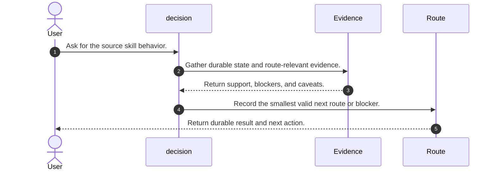
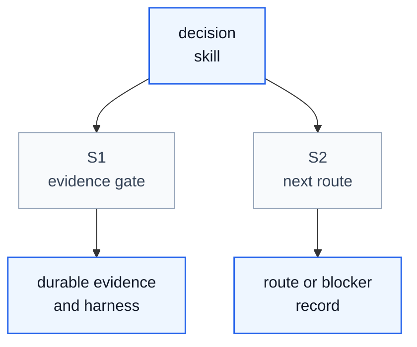

# Decision Skill Process

## Purpose

This note explains how the upstream DeepScientist `decision` skill operates as a skill process. It aligns the source entrypoint and directly linked workflow references copied under `org/src/`.

The key orchestration rule is: Decision makes one route judgment from durable evidence, records the verdict and smallest valid action, then gets the Research Topic moving again. It does not substitute for state reconciliation when the active line is still unclear.

## File Inventory

| Relative Path | Category | Purpose |
| --- | --- | --- |
| `SKILL.md` | entrypoint | Copied upstream source file preserved for migration audit. |
| `references/checkpoint-memory-template.md` | reference | Copied upstream source file preserved for migration audit. |
| `references/operational-guidance.md` | reference | Copied upstream source file preserved for migration audit. |
| `references/research-route-criteria.md` | reference | Copied upstream source file preserved for migration audit. |
| `references/strategic-decision-template.md` | reference | Copied upstream source file preserved for migration audit. |

## Concepts

- **Decision Context Brief**: Decision-ready summary of current state.
- **Route Question**: The explicit route choice being judged.
- **Decision Evidence Packet**: Evidence used to select the route.
- **Route Decision Record**: Durable verdict, action, reason, evidence, rejected alternatives, and next route.
- **Decision Checkpoint Memory**: Resume memory for route-changing decisions.
- **User Decision Request**: User-facing choice request when local evidence cannot resolve preference, scope, or cost.
- **Decision Blocker Record**: Why the route cannot be decided responsibly.

## High Level Process



## Skill Call Graph



| ID | Caller | Route | Callee | Calling condition |
| --- | --- | --- | --- | --- |
| S1 | `decision` | Evidence gate | Durable evidence and compatibility harness | The skill must gather route-relevant state before acting. |
| S2 | `decision` | Next route | Route or blocker record | The skill has enough evidence to move or stop. |

## Formal Skill Process

```python
@skill(name="decision", description="Source process for Isomer Research Decision Production DeepSci migration.")
def run_decision(user_request: str, context: object) -> StageResult:
    evidence = agent_do("Gather durable source evidence and route-relevant context.", context=context, returns=StageResult)
    if evidence.status in {"blocked", "failed"}:
        return evidence
    result = agent_do("Apply the source skill workflow and record the smallest valid next route or blocker.", context=evidence, returns=StageResult)
    return result
```

## Skill Process Explanation

- **Evidence first.** The source skill starts from durable state and does not rely on chat memory alone.
- **Bounded route work.** It performs only the work needed to satisfy its stage contract.
- **Durable handoff.** It ends with an explicit record, route, blocker, or continuation state.

## Evidence Handoffs

| Producing skill or stage | Evidence | Consuming stage |
| --- | --- | --- |
| `isomer-rsch-decision` | <DECISION_CONTEXT_BRIEF>: Decision-ready summary of current state. | `route judgment` |
| `isomer-rsch-decision` | <ROUTE_QUESTION>: The explicit route choice being judged. | `decision evidence packet` |
| `isomer-rsch-decision` | <DECISION_EVIDENCE_PACKET>: Evidence used to select the route. | `route decision record` |
| `isomer-rsch-decision` | <ROUTE_DECISION_RECORD>: Durable verdict, action, reason, evidence, rejected alternatives, and next route. | `any production DeepSci research skill` |
| `isomer-rsch-decision` | <DECISION_CHECKPOINT_MEMORY>: Resume memory for route-changing decisions. | `future work` |
| `isomer-rsch-decision` | <USER_DECISION_REQUEST>: User-facing choice request when local evidence cannot resolve preference, scope, or cost. | `user` |
| `isomer-rsch-decision` | <DECISION_BLOCKER_RECORD>: Why the route cannot be decided responsibly. | `user or continued decision work` |

## Self-Containment Check

- The document defines the important source terms needed to understand the process.
- The process order matches the rewritten production DeepSci skill contract.
- External harness calls and source routes are represented through migration placeholders.
