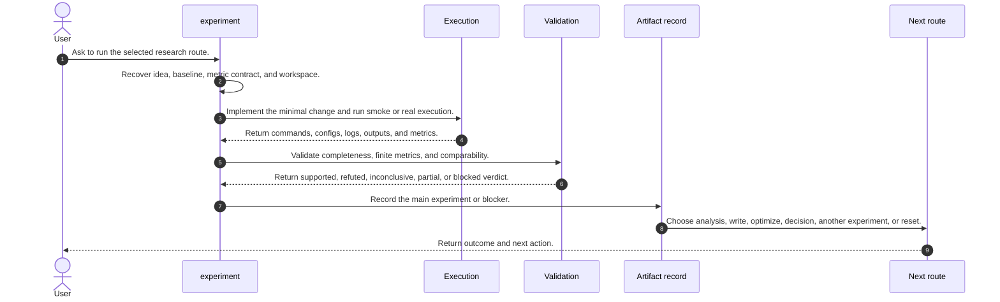
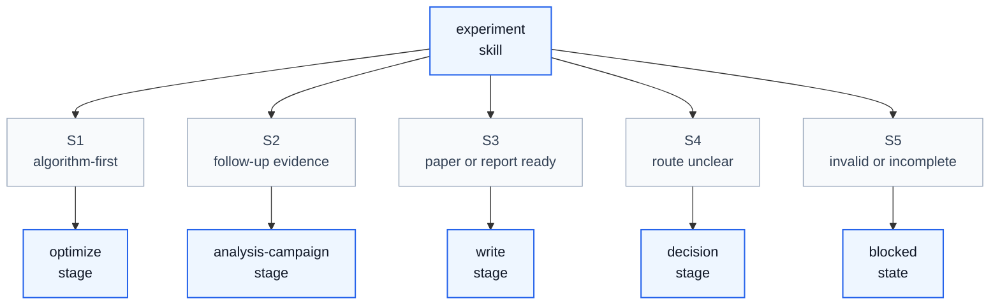

# Experiment Skill Process

## Purpose

This note explains how `experiment` operates as a skill process. It aligns `/home/huangzhe/workspace/code/isomer-labs/extern/orphan/DeepScientist/src/skills/experiment/SKILL.md`, its evidence-ladder, execution-playbook, main-experiment-plan, checklist, and operational-guidance references, and the compact workflow report in `context/explore/deepscientist-skill-analysis/experiment.md`.

The key orchestration rule is: `experiment` owns one measured run tied to a selected idea and accepted baseline, records it through `artifact.record_main_experiment(...)`, then routes from the evidence rather than from intent.

## Original Skill Directory Files

| File | What it is about |
| --- | --- |
| `SKILL.md` | Main `experiment` skill definition, run workflow, run contract rules, execution discipline, validation gates, failure handling, and exit criteria. |
| `references/evidence-ladder.md` | Evidence ladder for `minimum`, `solid`, and `maximum` experiment targets and auxiliary versus main evidence. |
| `references/execution-playbook.md` | Detailed execution playbook for run contracts, preflight, workspace confirmation, implementation, long-running commands, validation, recording, and next-route decisions. |
| `references/main-experiment-checklist-template.md` | Main experiment checklist template covering identity, in-progress work, next items, blockers, planning, implementation, smoke, run, validation, and closeout. |
| `references/main-experiment-plan-template.md` | Main experiment plan template covering map link, objective, node tasks, comparability, code translation, execution design, runtime strategy, fallbacks, checklist, and revisions. |
| `references/operational-guidance.md` | Operational guidance for planning surfaces, boundaries, resources, durable outputs, memory, artifacts, and connector-facing charts. |

## Concepts

- **Run Contract**: The fixed research question, selected idea, baseline reference, dataset, split, metric keys, stop condition, abandonment condition, and expected outputs.
- **Minimal Hypothesis-Bound Change**: The smallest code or config change needed to test the selected route without unrelated cleanup.
- **Smoke Or Pilot**: A bounded command-path, schema, or evaluator-wiring check that does not count as main evidence.
- **Real Run**: The evidence-bearing execution whose commands, configs, logs, outputs, metrics, and environment are preserved.
- **Evidence Ladder**: The staged target from `minimum` executable and comparable evidence, to `solid` claim-carrying evidence, to `maximum` polish after credibility is established.
- **Evaluation Summary**: The stable closeout fields including outcome summary, `evaluation_summary`, `claim_update`, `baseline_relation`, `failure_mode`, and `next_action`.
- **Main Experiment Record**: The durable `artifact.record_main_experiment(...)` result that makes the measured evidence usable by later stages.

## High Level Process



## Skill Call Graph



| ID | Caller | Route | Callee | Calling condition |
| --- | --- | --- | --- | --- |
| S1 | `experiment` | algorithm-first | `optimize` | A measured result should update an algorithm-first frontier before another large run. |
| S2 | `experiment` | follow-up evidence | `analysis-campaign` | A main result exists but ablation, robustness, failure, or limitation evidence is needed. |
| S3 | `experiment` | paper or report ready | `write` | The result is strong enough to support writing or report synthesis. |
| S4 | `experiment` | route unclear | `decision` | Evidence, cost, or branch implications require explicit route choice. |
| S5 | `experiment` | invalid or incomplete | blocked state | Metrics, comparability, environment, or output evidence are missing or non-comparable. |

## Formal Skill Process

```python
@skill(
    name="experiment",
    description="Turn one selected route into one trustworthy measured result.",
)
def run_experiment(user_request: str, workspace: Path | None = None) -> StageResult:
    context = agent_do(
        "Recover selected idea, accepted baseline, metric contract, current workspace, recent decisions, and run constraints.",
        context={"user_request": user_request, "workspace": workspace},
        returns=StageResult,
    )
    ready = agent_check(
        "Are the selected idea, baseline gate, evaluation contract, and execution surface ready for a main run?",
        context=context,
        returns=bool,
    )
    if not ready:
        # Condition matched when the run would have to guess the route, baseline, or metric contract.
        return agent_do("Record the missing precondition and next route.", context=context, returns=StageResult)

    contract = agent_do(
        "Lock the run contract and minimal hypothesis-bound change map before broad code edits.",
        context=context,
        returns=StageResult,
    )
    execution = agent_do(
        "Implement the minimum change, use bash_exec for smoke or real runs, and preserve commands, configs, logs, outputs, and state.",
        context={"contract": contract},
        returns=StageResult,
    )
    if execution.status in {"blocked", "failed"}:
        # Condition matched when execution fails before comparable metrics exist.
        return agent_do("Record failed or blocked experiment state with failure layer and best next action.", context=execution, returns=StageResult)

    validation = agent_check(
        "Are required metrics present, finite, traceable, and comparable to the accepted baseline contract?",
        context={"execution": execution, "contract": contract},
        returns=str,
        rubric="Return supported, refuted, inconclusive, partial, or blocked.",
    )
    if validation in {"supported", "refuted", "inconclusive"}:
        recorded = agent_invoke(
            "artifact.record_main_experiment",
            task="Record the main experiment with evaluation summary, claim update, baseline relation, failure mode, and next action.",
            context={"execution": execution, "validation": validation},
            returns=StageResult,
        )
        return agent_do(
            "Route from the measured evidence to optimize, analysis-campaign, write, decision, another experiment, reset, or stop.",
            context={"recorded": recorded},
            returns=StageResult,
        )
    return agent_do(
        "Record a partial or blocked run rather than claiming a complete main experiment.",
        context={"execution": execution, "validation": validation},
        returns=StageResult,
    )
```

## Skill Process Explanation

- **Context Recovery.** The skill starts from selected idea, accepted baseline, metric contract, workspace, recent decisions, and actual command constraints.
- **Run Contract.** The research question, dataset, split, required metrics, stop rules, outputs, and comparability rules are fixed before broad code changes.
- **Execution.** Shell, Python, package, Git, smoke, and real runs must go through `bash_exec(...)`; long runs preserve managed logs and progress markers.
- **Validation.** Smoke success does not count as main evidence; required metrics must be finite, traceable, and comparable, with deviations recorded.
- **Recording And Routing.** The run is complete only after `artifact.record_main_experiment(...)` succeeds, and the next route is chosen from measured evidence.

## Evidence Handoffs

| Producing skill or stage | Evidence | Consuming stage |
| --- | --- | --- |
| `idea` and `baseline` | Selected idea handoff, accepted baseline, and metric contract. | `experiment` context recovery |
| Run contract | Question, data, metrics, stop rules, code-change map, and expected outputs. | Execution |
| Execution | Commands, configs, logs, outputs, seeds, environment snapshot, and metric files. | Validation |
| Validation | Supported, refuted, inconclusive, partial, or blocked verdict with caveats. | Main experiment recording |
| `artifact.record_main_experiment(...)` | Durable measured result and next action. | `optimize`, `analysis-campaign`, `write`, `decision`, or next experiment |
