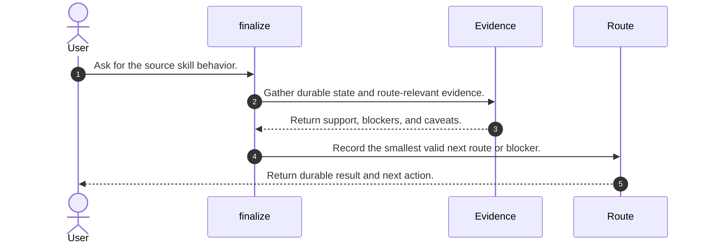
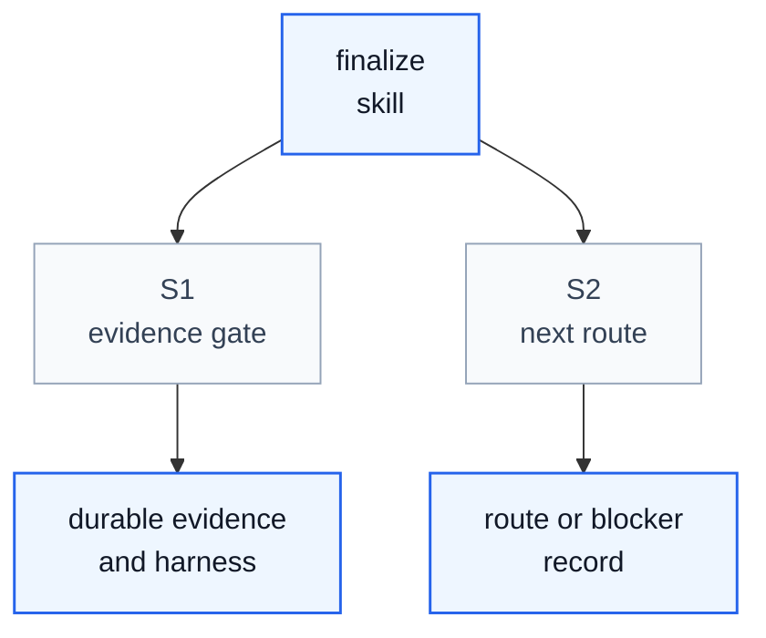

# Finalize Skill Process

## Purpose

This note explains how the upstream DeepScientist `finalize` skill operates as a skill process. It aligns the source entrypoint and directly linked workflow references copied under `org/src/`.

The key orchestration rule is: Finalize closes or pauses work responsibly. It consolidates accepted evidence, records claim status and limitations, chooses stop, park, publish, or continue-later routing, and refuses closure when evidence or writing gates still block it.

## File Inventory

| Relative Path | Category | Purpose |
| --- | --- | --- |
| `SKILL.md` | entrypoint | Copied upstream source file preserved for migration audit. |
| `references/checkpoint-memory-template.md` | reference | Copied upstream source file preserved for migration audit. |
| `references/finalization-checklist.md` | reference | Copied upstream source file preserved for migration audit. |
| `references/resume-packet-template.md` | reference | Copied upstream source file preserved for migration audit. |

## Concepts

- **Finalize Context Brief**: Closure context for the Research Topic or Inquiry.
- **Claim Ledger**: Claim status, evidence, caveats, and safe-surface decision.
- **Final Limitations Report**: Final limitations, failures, deferred risks, and unsupported outcomes.
- **Final Summary**: Responsible final or pause-state summary.
- **Resume Packet**: Clean continuation path when later work is plausible.
- **Closure Decision**: Durable closure or route-back decision.
- **Finalize Blocker Record**: Why finalization is not responsible yet.

## High Level Process



## Skill Call Graph



| ID | Caller | Route | Callee | Calling condition |
| --- | --- | --- | --- | --- |
| S1 | `finalize` | Evidence gate | Durable evidence and compatibility harness | The skill must gather route-relevant state before acting. |
| S2 | `finalize` | Next route | Route or blocker record | The skill has enough evidence to move or stop. |

## Formal Skill Process

```python
@skill(name="finalize", description="Source process for Isomer Research Finalize Production DeepSci migration.")
def run_finalize(user_request: str, context: object) -> StageResult:
    evidence = agent_do("Gather durable source evidence and route-relevant context.", context=context, returns=StageResult)
    if evidence.status in {"blocked", "failed"}:
        return evidence
    result = agent_do("Apply the source skill workflow and record the smallest valid next route or blocker.", context=evidence, returns=StageResult)
    return result
```

## Skill Process Explanation

- **Evidence first.** The source skill starts from durable state and does not rely on chat memory alone.
- **Bounded route work.** It performs only the work needed to satisfy its stage contract.
- **Durable handoff.** It ends with an explicit record, route, blocker, or continuation state.

## Evidence Handoffs

| Producing skill or stage | Evidence | Consuming stage |
| --- | --- | --- |
| `isomer-rsch-finalize` | <FINALIZE_CONTEXT_BRIEF>: Closure context for the Research Topic or Inquiry. | `closure gate` |
| `isomer-rsch-finalize` | <CLAIM_LEDGER>: Claim status, evidence, caveats, and safe-surface decision. | `final summary, writing, archive` |
| `isomer-rsch-finalize` | <FINAL_LIMITATIONS_REPORT>: Final limitations, failures, deferred risks, and unsupported outcomes. | `final summary and user` |
| `isomer-rsch-finalize` | <FINAL_SUMMARY>: Responsible final or pause-state summary. | `user and future work` |
| `isomer-rsch-finalize` | <RESUME_PACKET>: Clean continuation path when later work is plausible. | `future work` |
| `isomer-rsch-finalize or decision` | <CLOSURE_DECISION>: Durable closure or route-back decision. | `user and future work` |
| `isomer-rsch-finalize` | <FINALIZE_BLOCKER_RECORD>: Why finalization is not responsible yet. | `decision or upstream skill` |
| `isomer-rsch-finalize` | <FINALIZE_CONTINUITY_UPDATE>: Continuity record after finalization. | `future work` |

## Self-Containment Check

- The document defines the important source terms needed to understand the process.
- The process order matches the rewritten production DeepSci skill contract.
- External harness calls and source routes are represented through migration placeholders.
