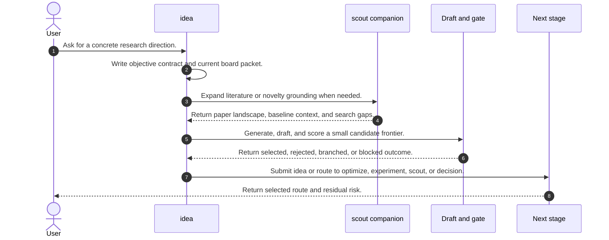
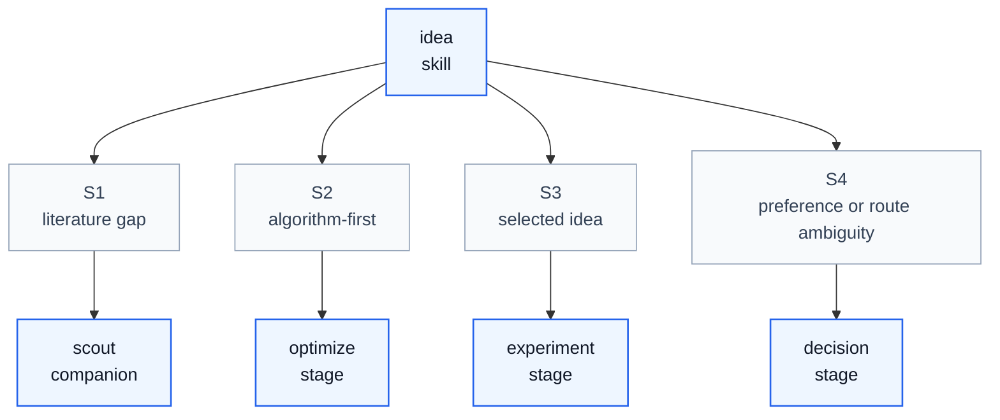

# Idea Skill Process

## Purpose

This note explains how `idea` operates as a skill process. It aligns `/home/huangzhe/workspace/code/isomer-labs/extern/orphan/DeepScientist/src/skills/idea/SKILL.md`, its objective-contract, current-board, related-work, research-history, literature-survey, high-value sourcing, thinking-flow, generation, controlled-brainstorming, pre-idea-draft, selection-gate, outline-seeding, and research-outline references, and the compact workflow report in `context/explore/deepscientist-skill-analysis/idea.md`.

The key orchestration rule is: `idea` owns direction selection by grounding the objective, current board, literature, and bottleneck before promoting one falsifiable route to `experiment` or handing an algorithm-first brief frontier to `optimize`.

## Original Skill Directory Files

| File | What it is about |
| --- | --- |
| `SKILL.md` | Main `idea` skill definition, direction-selection workflow, literature mandates, ideation protocol, artifact rules, memory rules, and exit criteria. |
| `references/controlled-brainstorming-playbook.md` | Playbook for bounded candidate generation, family-mix selection, filtering, `why now`, and structured selection. |
| `references/current-board-packet-template.md` | Template for compressing incumbent, latest result, blocker, stale routes, and current questions into one board packet. |
| `references/high-value-idea-sourcing.md` | Guide for finding important contradictions, novelty sources, mechanism questions, and local-optimum risks. |
| `references/idea-generation-playbook.md` | End-to-end idea generation playbook from limitation card to direction families, candidate selection, and ledgering. |
| `references/idea-thinking-flow.md` | Reasoning hygiene flow for limitation-first thinking, competing hypotheses, mechanism maps, falsification, reader value, and self-checks. |
| `references/literature-survey-template.md` | Template for survey headers, memory reuse, search ledger, paper buckets, closest-prior-work table, novelty verdict, and idea implications. |
| `references/objective-contract-template.md` | Template for real target, proxies, false-progress signals, constraints, metric, and exit rule. |
| `references/outline-seeding-example.md` | Minimal paper-outline seed example for idea-stage routes that are likely to become paper-facing. |
| `references/pre-idea-draft-template.md` | Template for candidate challenge memos covering literature grounding, hidden assumptions, rejection case, testability, and verdict. |
| `references/related-work-playbook.md` | Search and comparison playbook for source order, query families, history-aware passes, cross-domain translation, and novelty triage. |
| `references/research-history-playbook.md` | Playbook for field maps, paper roles, citation chaining, lineage tables, review intents, and stopping criteria. |
| `references/research-outline-template.md` | Structured research-outline template covering executive summary, codebase, dataset, math formulation, directions, metrics, and constraints. |
| `references/selection-gate.md` | Selection and handoff gate for value, feasibility, quality, novelty labels, mechanism, falsification, and experiment fields. |

## Concepts

- **Objective Contract**: A durable statement of real target, trusted proxies, false-progress signals, hard constraints, metric, and contribution frame.
- **Current Board Packet**: A compact current-state surface covering incumbent, latest decisive result, active blocker, stale routes, and current foundation.
- **Important Contradiction**: The bottleneck, anomaly, failure region, or unmet need that should drive ideation.
- **Literature Survey Report**: A durable survey with search ledger, paper buckets, closest-prior-work table, novelty and value verdict, and citation-ready shortlist.
- **Candidate Frontier**: A small differentiated set of serious candidate ideas, normally narrowed from a bounded raw slate.
- **Pre-Idea Draft**: A compact challenge memo for a serious candidate that exposes assumptions, local-optimum risk, rejection case, falsification path, and verdict.
- **Selection Gate**: The value, feasibility, novelty, falsifiability, evidence-quality, and constraint-fit check that must pass before promotion.
- **Selected Idea Package**: The durable handoff with stable id, pitch, hypothesis, mechanism, risk, anti-win condition, minimal validation, abandonment condition, citations, and next stage.

## High Level Process



## Skill Call Graph



| ID | Caller | Route | Callee | Calling condition |
| --- | --- | --- | --- | --- |
| S1 | `idea` | literature gap | `scout` | Novelty, baseline landscape, or paper coverage is too weak for honest selection. |
| S2 | `idea` | algorithm-first | `optimize` | Research-paper delivery is disabled or secondary, a concrete optimization handle exists, and the output is a method-brief frontier. |
| S3 | `idea` | selected idea | `experiment` | One selected idea has a falsifiable hypothesis, metric-bound handoff, and experiment-ready contract. |
| S4 | `idea` | preference or route ambiguity | `decision` | Several plausible routes remain preference-sensitive, or candidate evidence cannot be ranked objectively. |

## Formal Skill Process

```python
@skill(
    name="idea",
    description="Turn a grounded research frame into a selected falsifiable direction.",
)
def run_idea(user_request: str, quest_root: Path | None = None) -> StageResult:
    preconditions = agent_check(
        "Are the accepted baseline, dataset, metric contract, code path, and basic frame clear enough for ideation?",
        context={"user_request": user_request, "quest_root": quest_root},
        returns=bool,
    )
    if not preconditions:
        # Condition matched when baseline, metric contract, or frame is not ready.
        return agent_do(
            "Route back to baseline, scout, decision, or intake-audit with the missing precondition named.",
            context={"user_request": user_request},
            returns=StageResult,
        )

    objective = agent_do(
        "Write or refresh the objective contract and current board packet.",
        context={"quest_root": quest_root},
        returns=StageResult,
    )
    survey = agent_do(
        "Reuse quest memory, search missing literature buckets, and write a durable literature survey and related-work map.",
        context={"objective": objective},
        returns=StageResult,
    )
    if survey.status in {"blocked", "failed"}:
        # Condition matched when novelty or value cannot be judged from available evidence.
        return agent_invoke(
            "scout",
            task="Resolve the literature, baseline landscape, or framing gap that blocks idea selection.",
            context={"objective": objective, "survey": survey},
            returns=StageResult,
        )

    frontier = agent_do(
        "Extract limitations, run bounded divergent ideation, and reduce to a small differentiated candidate frontier.",
        context={"objective": objective, "survey": survey},
        returns=StageResult,
    )
    drafts = agent_do(
        "Write pre-idea drafts for the serious surviving candidates and compare them against the incumbent and alternatives.",
        context={"frontier": frontier},
        returns=StageResult,
    )
    selection = agent_check(
        "Does one candidate pass the selection gate with novelty or research value, feasibility, falsifiability, and constraint fit?",
        context={"drafts": drafts, "survey": survey},
        returns=str,
        rubric="Return selected, branch, reject_to_scout, preference_blocked, or evidence_blocked.",
    )
    if selection == "selected":
        selected = agent_do(
            "Finalize the selected idea draft with citations and submit the durable idea artifact.",
            context={"drafts": drafts, "survey": survey},
            returns=StageResult,
        )
        next_stage = agent_select(
            ["experiment", "optimize"],
            criterion="Choose experiment for a selected measured route, optimize for an algorithm-first brief frontier.",
            context={"selected": selected, "user_request": user_request},
        )
        return agent_invoke(next_stage, task="Continue from the selected idea handoff.", context={"selected": selected}, returns=StageResult)
    return agent_do(
        "Record the branch, rejection, return-to-scout, preference decision, or blocker outcome.",
        context={"selection": selection, "drafts": drafts},
        returns=StageResult,
    )
```

## Skill Process Explanation

- **Precondition Gate.** `idea` should not run when the baseline gate, dataset, metric contract, or current board is unresolved.
- **Objective And Board.** The skill writes a durable target and current-state surface before brainstorming, which prevents false progress and stale-route reuse.
- **Literature And History.** Memory, prior quest artifacts, web discovery, DeepXiv when available, citation chaining, and `artifact.arxiv(...)` feed a durable survey with closest-prior-work comparison.
- **Diverge Then Converge.** The skill generates a bounded raw slate only after grounding, then narrows it to a serious frontier with differentiated mechanism, objective, measurement, or infrastructure families.
- **Draft Before Submit.** Serious candidates need pre-idea drafts or equivalent challenge memos before the selected idea is submitted.
- **Handoff Or Block.** A passing idea is submitted through `artifact.submit_idea(...)` and routed to `experiment` or `optimize`; weak evidence routes back to `scout`, `decision`, or a blocked state.

## Evidence Handoffs

| Producing skill or stage | Evidence | Consuming stage |
| --- | --- | --- |
| `idea` objective setup | Objective contract and current board packet. | Literature search and limitation analysis |
| `scout` companion or idea search | Related-work map, literature survey, closest-prior-work table, and survey delta. | Candidate generation and selection gate |
| Candidate generation | Raw slate, serious frontier, rejected and deferred alternatives. | Pre-idea draft stage |
| Pre-idea draft stage | Challenge memos with assumptions, rejection case, falsification path, and verdict. | Selection gate |
| Selection gate | Selected idea, branch decision, rejection, or blocker. | `experiment`, `optimize`, `scout`, or `decision` |
