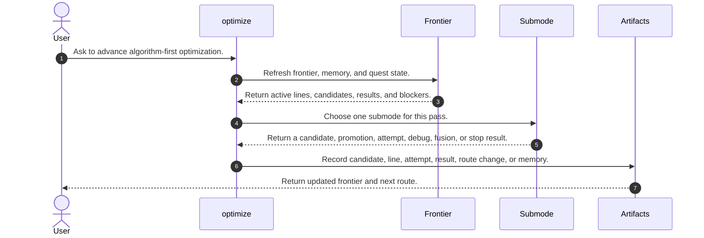
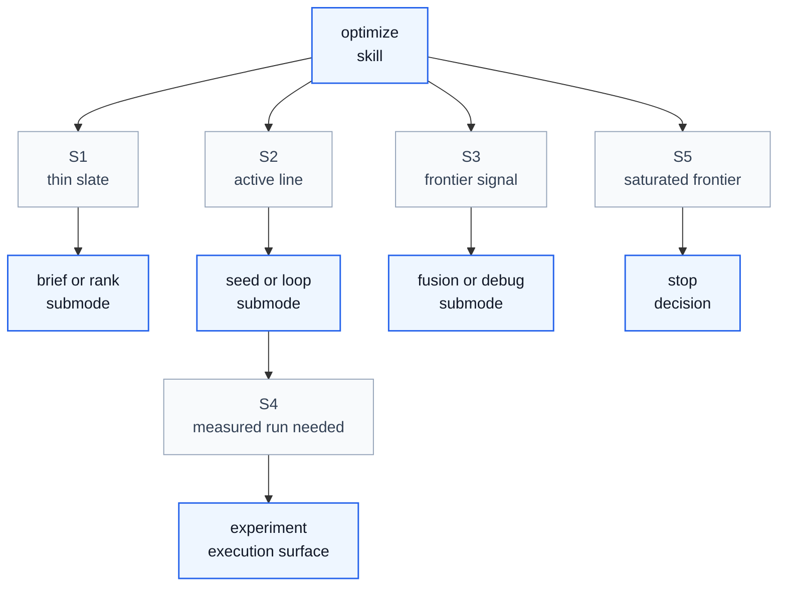

# Optimize Skill Process

## Purpose

This note explains how `optimize` operates as a skill process. It aligns `/home/huangzhe/workspace/code/isomer-labs/extern/orphan/DeepScientist/src/skills/optimize/SKILL.md`, its operational-guidance, brief-shaping, candidate-board, candidate-ranking, frontier-review, method-brief, codegen-route, debug, fusion, memory, checklist, plateau, and prompt-pattern references, and the compact workflow report in `context/explore/deepscientist-skill-analysis/optimize.md`.

The key orchestration rule is: `optimize` owns algorithm-first frontier management by choosing one submode per pass, keeping candidate briefs distinct from durable lines and implementation attempts, and recording exactly one next route or stop condition.

## Original Skill Directory Files

| File | What it is about |
| --- | --- |
| `SKILL.md` | Main `optimize` skill definition, frontier workflow, submodes, object model, artifact rules, and exit criteria. |
| `references/brief-shaping-playbook.md` | Playbook for turning loose directions into differentiated candidate briefs and a lead recommendation. |
| `references/candidate-board-template.md` | Minimal `CANDIDATE_BOARD.md` template for tracking candidate state. |
| `references/candidate-ranking-template.md` | Template for candidate set, scoring criteria, ranked candidates, winner justification, and promotion cap. |
| `references/codegen-route-playbook.md` | Guidance for choosing brief-only, stepwise generation, diff or patch generation, or full rewrite routes. |
| `references/debug-response-template.md` | Template for optimization debug responses with error, memory, root cause, minimal fix, and next check. |
| `references/frontier-review-template.md` | Template for current frontier, evidence summary, route choice, active submode, and immediate next action. |
| `references/fusion-playbook.md` | Playbook for combining complementary optimization lines when fusion is the justified frontier route. |
| `references/method-brief-template.md` | Method brief template covering bottleneck, mechanism, family, change layer, expected gain, implementation surface, risks, foundation, and next target. |
| `references/operational-guidance.md` | Detailed optimize workflow for working surfaces, frontier recovery, submode selection, candidate protocol, promotion, seed, loop, memory, artifacts, execution, debug, fusion, plateau, and completion. |
| `references/optimization-memory-template.md` | Template for reusable optimization memory cards with context, observation, impact, retrieval hint, and reuse hint. |
| `references/optimize-checklist-template.md` | `OPTIMIZE_CHECKLIST.md` template for frontier and execution tracking. |
| `references/plateau-response-playbook.md` | Guidance for plateau indicators, required response, and non-retry discipline. |
| `references/prompt-patterns.md` | Prompt skeletons and reasoning contracts for optimization, plateau, fusion, and debug work. |

## Concepts

- **Optimization Frontier**: The durable state of candidate briefs, active lines, recent measured results, failures, and the recommended next optimization route.
- **Candidate Brief**: A branchless method proposal recorded with `artifact.submit_idea(..., submission_mode='candidate')`.
- **Durable Optimization Line**: A promoted research line recorded with `artifact.submit_idea(..., submission_mode='line')` that deserves branch or worktree state.
- **Implementation-Level Candidate Attempt**: A within-line patch, smoke candidate, debug candidate, or fusion candidate recorded as an optimization candidate report.
- **Optimize Submode**: One internal pass type selected from `brief`, `rank`, `seed`, `loop`, `fusion`, `debug`, or `stop`.
- **Frontier Route**: The next route meaning selected from `explore`, `exploit`, `fusion`, `debug`, or `stop`.
- **Plateau**: A repeated non-improvement signal that should trigger route review rather than more same-family micro-edits.

## High Level Process



## Skill Call Graph



| ID | Caller | Route | Callee | Calling condition |
| --- | --- | --- | --- | --- |
| S1 | `optimize` | thin slate | `brief` or `rank` submode | Candidate briefs are missing, weak, or numerous enough that promotion is the main unresolved question. |
| S2 | `optimize` | active line | `seed` or `loop` submode | A durable line exists and needs a bounded implementation pool or one execution move. |
| S3 | `optimize` | frontier signal | `fusion` or `debug` submode | Complementary lines or a concrete fixable failure should drive the pass. |
| S4 | `optimize` | measured run needed | `experiment` | A real line result needs the experiment execution surface and `artifact.record_main_experiment(...)`. |
| S5 | `optimize` | saturated frontier | stop decision | Remaining routes are low-value, repeated, or not justified relative to cost. |

## Formal Skill Process

```python
@skill(
    name="optimize",
    description="Manage an algorithm-first optimization frontier one justified move at a time.",
)
def run_optimize(user_request: str, quest_root: Path | None = None) -> StageResult:
    frontier = agent_invoke(
        "artifact.get_optimization_frontier",
        task="Refresh the optimization frontier before creating or promoting anything.",
        context={"user_request": user_request, "quest_root": quest_root},
        returns=StageResult,
    )
    memory = agent_do(
        "Recover recent optimization memory and same-line attempt lessons before repeating old moves.",
        context={"frontier": frontier},
        returns=StageResult,
    )
    submode = agent_select(
        ["fusion", "debug", "rank", "brief", "seed", "loop", "stop"],
        criterion="Choose exactly one primary optimize submode from frontier state and route signals.",
        context={"frontier": frontier, "memory": memory},
    )
    if submode == "stop":
        # Condition matched when the frontier is saturated or remaining moves are not justified.
        return agent_do(
            "Record the stop decision and non-retry rationale durably.",
            context={"frontier": frontier, "memory": memory},
            returns=StageResult,
        )

    move = agent_do(
        "Execute the selected optimize submode while preserving candidate, line, and attempt boundaries.",
        context={"submode": submode, "frontier": frontier, "memory": memory},
        returns=StageResult,
    )
    if move.status in {"blocked", "failed"}:
        # Condition matched when an attempted route has a concrete blocker or failed without useful evidence.
        return move

    measured = agent_check(
        "Did this move produce a real measured line result that belongs in the main experiment record?",
        context={"move": move, "submode": submode},
        returns=bool,
    )
    if measured:
        result = agent_invoke(
            "experiment",
            task="Run or record the measured result for the active durable optimization line.",
            context={"move": move, "frontier": frontier},
            returns=StageResult,
        )
    else:
        result = agent_do(
            "Record candidate brief, durable line, optimization-candidate report, debug result, fusion result, or route decision.",
            context={"move": move, "submode": submode},
            returns=StageResult,
        )
    return agent_do(
        "Update the frontier and choose one next route: explore, exploit, fusion, debug, or stop.",
        context={"frontier": frontier, "result": result},
        returns=StageResult,
    )
```

## Skill Process Explanation

- **Frontier Recovery.** `optimize` begins with `artifact.get_optimization_frontier(...)`, recent memory, and quest state, so new work is evaluated against the current frontier rather than chat memory.
- **Submode Selection.** The skill chooses one submode per pass, which keeps brief shaping, ranking, seeding, looping, fusion, and debugging from mixing into an unreadable route change.
- **Object-Level Discipline.** Candidate briefs, durable optimization lines, and implementation attempts have different artifact surfaces and should not be collapsed.
- **Execution Boundary.** `optimize` may shape and manage the route, but measured runs route through `experiment` and return to `optimize` or `decision` for frontier review.
- **Route Closeout.** Each pass records a dominant next action or stop condition, plus memory when the pass produced reusable success, failure, fusion, or non-retry lessons.

## Evidence Handoffs

| Producing skill or stage | Evidence | Consuming stage |
| --- | --- | --- |
| Frontier recovery | Current candidates, lines, results, blockers, and route recommendation. | Submode selection |
| `brief` or `rank` | Candidate briefs, ranking table, promotion justification, and non-winner notes. | Promotion protocol or frontier update |
| `seed`, `loop`, `fusion`, or `debug` | Implementation-level attempts, debug findings, fusion rationale, or measured result need. | `experiment` or artifact recording |
| `experiment` | Main experiment result for a durable optimization line. | Frontier review |
| Frontier review | Next route: explore, exploit, fusion, debug, or stop. | Next optimize pass or quest decision |
