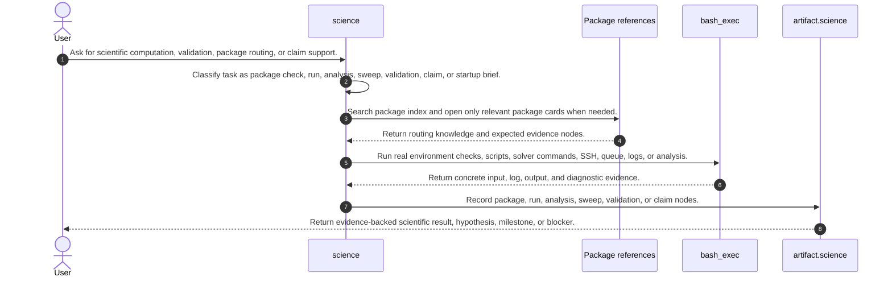
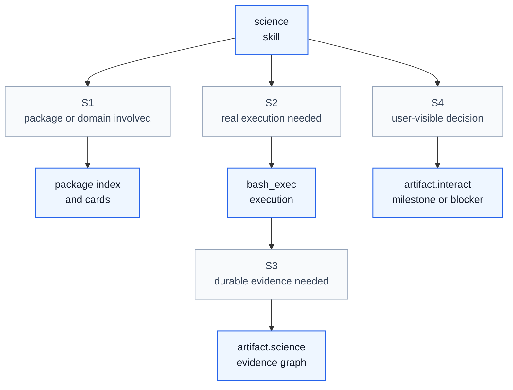

# Science Skill Process

## Purpose

This note explains how `science` operates as a skill process. It aligns `/home/huangzhe/workspace/code/isomer-labs/extern/orphan/DeepScientist/src/skills/science/SKILL.md`, its artifact-science-tool, claim-type-discipline, package-check, HPC, domain-index, package-index, and science-task-brief references, and the compact workflow report in `context/explore/deepscientist-skill-analysis/science.md`.

The key orchestration rule is: `science` owns scientific routing and evidence discipline, while real execution stays in `bash_exec(...)` and durable evidence is recorded through `artifact.science(...)` Science Evidence Graph nodes.

## Original Skill Directory Files

| File | What it is about |
| --- | --- |
| `PROVENANCE.md` | Provenance notes for the generated DeepScientist science skill and its FermiLink-derived package catalog. |
| `SKILL.md` | Main `science` skill definition, match signals, progressive-disclosure rules, workflow, node types, claim discipline, SetupAgent usage, and validation. |
| `references/artifact-science-tool.md` | Reference for `artifact.science(...)` actions, common fields, evidence rules, statuses, and examples. |
| `references/claim-type-discipline.md` | Claim-type guide for `computed`, `parsed`, `digitized`, and `hypothesis` science claims and upgrade paths. |
| `references/domain-index.md` | Human-readable package grouping by scientific domain and common tags. |
| `references/hpc-via-bash-exec.md` | Pattern for SSH, scheduler, queue, log, and evidence handling for HPC through `bash_exec(...)`. |
| `references/package-check-playbook.md` | Package availability check patterns for Python modules and CLI solvers, plus package-check recording. |
| `references/package-index.min.json` | Compact JSON index of the 169 package-card files and their FermiLink catalog metadata. |
| `references/science-task-brief-template.md` | Template for science task briefs and scientific code optimization briefs. |
| `references/packages/abinit.md` | Package routing card for ABINIT Electronic-Structure Suite; used for package-specific checks, evidence paths, and pitfalls. |
| `references/packages/acts.md` | Package routing card for ACTS Common Tracking Software; used for package-specific checks, evidence paths, and pitfalls. |
| `references/packages/aiida-core.md` | Package routing card for AiiDA Core Workflow Engine; used for package-specific checks, evidence paths, and pitfalls. |
| `references/packages/alamode.md` | Package routing card for ALAMODE Lattice Thermal Transport; used for package-specific checks, evidence paths, and pitfalls. |
| `references/packages/amuse.md` | Package routing card for AMUSE Astrophysical Simulation Environment; used for package-specific checks, evidence paths, and pitfalls. |
| `references/packages/anndata.md` | Package routing card for AnnData Annotated Data Matrices; used for package-specific checks, evidence paths, and pitfalls. |
| `references/packages/arbor.md` | Package routing card for Arbor Neural Simulation Library; used for package-specific checks, evidence paths, and pitfalls. |
| `references/packages/arc.md` | Package routing card for ARC Alkali Rydberg Calculator; used for package-specific checks, evidence paths, and pitfalls. |
| `references/packages/astropy.md` | Package routing card for Astropy Astronomy Core Library; used for package-specific checks, evidence paths, and pitfalls. |
| `references/packages/astroquery.md` | Package routing card for Astroquery Astronomical Data Access; used for package-specific checks, evidence paths, and pitfalls. |
| `references/packages/atomate2.md` | Package routing card for Atomate2 Materials Workflow Library; used for package-specific checks, evidence paths, and pitfalls. |
| `references/packages/atomsmltr.md` | Package routing card for atomSmltr Laser Cooling and Trapping Simulator; used for package-specific checks, evidence paths, and pitfalls. |
| `references/packages/awkward.md` | Package routing card for Awkward Array; used for package-specific checks, evidence paths, and pitfalls. |
| `references/packages/batman.md` | Package routing card for BATMAN Exoplanet Transit Light-Curve Modeler; used for package-specific checks, evidence paths, and pitfalls. |
| `references/packages/biopython.md` | Package routing card for Biopython; used for package-specific checks, evidence paths, and pitfalls. |
| `references/packages/bloqade.md` | Package routing card for Bloqade Neutral Atom Quantum SDK; used for package-specific checks, evidence paths, and pitfalls. |
| `references/packages/brian2.md` | Package routing card for Brian2 Spiking Neural Network Simulator; used for package-specific checks, evidence paths, and pitfalls. |
| `references/packages/bullet3.md` | Package routing card for Bullet Physics SDK (bullet3); used for package-specific checks, evidence paths, and pitfalls. |
| `references/packages/calculix.md` | Package routing card for CalculiX Finite Element Program; used for package-specific checks, evidence paths, and pitfalls. |
| `references/packages/cantera.md` | Package routing card for Cantera Chemical Kinetics and Combustion; used for package-specific checks, evidence paths, and pitfalls. |
| `references/packages/cavity-md-ipi.md` | Package routing card for CavMD: Cavity Molecular Dynamics; used for package-specific checks, evidence paths, and pitfalls. |
| `references/packages/ccdproc.md` | Package routing card for CCDProc CCD Image Reduction; used for package-specific checks, evidence paths, and pitfalls. |
| `references/packages/celerite2.md` | Package routing card for celerite2 Gaussian Process Toolkit; used for package-specific checks, evidence paths, and pitfalls. |
| `references/packages/cellrank.md` | Package routing card for CellRank Single-Cell Fate Mapping; used for package-specific checks, evidence paths, and pitfalls. |
| `references/packages/cesm.md` | Package routing card for CESM (Community Earth System Model); used for package-specific checks, evidence paths, and pitfalls. |
| `references/packages/chemicals.md` | Package routing card for Chemicals Thermophysical Data Library; used for package-specific checks, evidence paths, and pitfalls. |
| `references/packages/chempy.md` | Package routing card for ChemPy Chemical Modeling Toolkit; used for package-specific checks, evidence paths, and pitfalls. |
| `references/packages/cirq.md` | Package routing card for Cirq Quantum Circuit Framework; used for package-specific checks, evidence paths, and pitfalls. |
| `references/packages/coffea.md` | Package routing card for Coffea Collider HEP Analysis Framework; used for package-specific checks, evidence paths, and pitfalls. |
| `references/packages/cp2k.md` | Package routing card for CP2K Quantum Chemistry Suite; used for package-specific checks, evidence paths, and pitfalls. |
| `references/packages/custodian.md` | Package routing card for Custodian JIT Simulation Job Manager; used for package-specific checks, evidence paths, and pitfalls. |
| `references/packages/dart.md` | Package routing card for DART Robotics Dynamics Engine; used for package-specific checks, evidence paths, and pitfalls. |
| `references/packages/datamol.md` | Package routing card for Datamol Molecular Processing Toolkit; used for package-specific checks, evidence paths, and pitfalls. |
| `references/packages/dd4hep.md` | Package routing card for DD4hep Detector Description Toolkit; used for package-specific checks, evidence paths, and pitfalls. |
| `references/packages/dealii.md` | Package routing card for deal.II Finite Element Library; used for package-specific checks, evidence paths, and pitfalls. |
| `references/packages/deepchem.md` | Package routing card for DeepChem Molecular Machine Learning Toolkit; used for package-specific checks, evidence paths, and pitfalls. |
| `references/packages/delphes.md` | Package routing card for Delphes Fast Collider Simulation; used for package-specific checks, evidence paths, and pitfalls. |
| `references/packages/devito.md` | Package routing card for Devito Stencil Compiler; used for package-specific checks, evidence paths, and pitfalls. |
| `references/packages/dftb.md` | Package routing card for DFTB+ Atomistic Simulator; used for package-specific checks, evidence paths, and pitfalls. |
| `references/packages/dftd4.md` | Package routing card for DFT-D4 Dispersion Correction; used for package-specific checks, evidence paths, and pitfalls. |
| `references/packages/dftk-jl.md` | Package routing card for DFTK.jl Density-Functional Toolkit; used for package-specific checks, evidence paths, and pitfalls. |
| `references/packages/dolfinx.md` | Package routing card for DOLFINx; used for package-specific checks, evidence paths, and pitfalls. |
| `references/packages/drake.md` | Package routing card for Drake Robotics Toolkit; used for package-specific checks, evidence paths, and pitfalls. |
| `references/packages/dumux.md` | Package routing card for DuMux Porous Media Simulator; used for package-specific checks, evidence paths, and pitfalls. |
| `references/packages/elk.md` | Package routing card for Elk All-Electron DFT Code; used for package-specific checks, evidence paths, and pitfalls. |
| `references/packages/elmerfem.md` | Package routing card for Elmer FEM; used for package-specific checks, evidence paths, and pitfalls. |
| `references/packages/enzo-e.md` | Package routing card for Enzo-E Exascale Astrophysics Simulator; used for package-specific checks, evidence paths, and pitfalls. |
| `references/packages/espresso.md` | Package routing card for ESPResSo Soft-Matter Molecular Dynamics; used for package-specific checks, evidence paths, and pitfalls. |
| `references/packages/exoplanet.md` | Package routing card for exoplanet Bayesian Exoplanet Inference Toolkit; used for package-specific checks, evidence paths, and pitfalls. |
| `references/packages/fairroot.md` | Package routing card for FairRoot Particle Physics Framework; used for package-specific checks, evidence paths, and pitfalls. |
| `references/packages/fbpic.md` | Package routing card for FBPIC Spectral Quasi-3D PIC; used for package-specific checks, evidence paths, and pitfalls. |
| `references/packages/fdtdbath-meep.md` | Package routing card for Modified Meep FDTD Electromagnetics Simulator for FDTD-Bath approach of condensed-phase polaritonics; used for package-specific checks, evidence paths, and pitfalls. |
| `references/packages/geant4.md` | Package routing card for Geant4 Particle-Matter Simulation Toolkit; used for package-specific checks, evidence paths, and pitfalls. |
| `references/packages/geosx.md` | Package routing card for GEOSX Subsurface Multiphysics Framework; used for package-specific checks, evidence paths, and pitfalls. |
| `references/packages/gprmax.md` | Package routing card for gprMax Ground Penetrating Radar Simulator; used for package-specific checks, evidence paths, and pitfalls. |
| `references/packages/gromacs.md` | Package routing card for GROMACS Molecular Dynamics; used for package-specific checks, evidence paths, and pitfalls. |
| `references/packages/gwaslab.md` | Package routing card for GWASLab Summary Statistics Toolkit; used for package-specific checks, evidence paths, and pitfalls. |
| `references/packages/gz-sim.md` | Package routing card for Gazebo Sim (gz-sim); used for package-specific checks, evidence paths, and pitfalls. |
| `references/packages/hail.md` | Package routing card for Hail Genomics Analytics; used for package-specific checks, evidence paths, and pitfalls. |
| `references/packages/hiphive.md` | Package routing card for hiphive Force-Constant Modeling; used for package-specific checks, evidence paths, and pitfalls. |
| `references/packages/hoomd-blue.md` | Package routing card for HOOMD-blue Particle Simulation; used for package-specific checks, evidence paths, and pitfalls. |
| `references/packages/itensor.md` | Package routing card for ITensor Tensor Network Library; used for package-specific checks, evidence paths, and pitfalls. |
| `references/packages/itensors-jl.md` | Package routing card for ITensors.jl Tensor Network Library; used for package-specific checks, evidence paths, and pitfalls. |
| `references/packages/jdftx.md` | Package routing card for JDFTx; used for package-specific checks, evidence paths, and pitfalls. |
| `references/packages/jobflow.md` | Package routing card for Jobflow Computational Workflow Library; used for package-specific checks, evidence paths, and pitfalls. |
| `references/packages/kadanoffbaym-jl.md` | Package routing card for KadanoffBaym.jl; used for package-specific checks, evidence paths, and pitfalls. |
| `references/packages/kite.md` | Package routing card for KITE Quantum Transport Suite; used for package-specific checks, evidence paths, and pitfalls. |
| `references/packages/kratos.md` | Package routing card for Kratos Multiphysics; used for package-specific checks, evidence paths, and pitfalls. |
| `references/packages/kwant.md` | Package routing card for Kwant Quantum Transport Toolkit; used for package-specific checks, evidence paths, and pitfalls. |
| `references/packages/lammps.md` | Package routing card for LAMMPS Molecular Dynamics; used for package-specific checks, evidence paths, and pitfalls. |
| `references/packages/lightkurve.md` | Package routing card for Lightkurve Kepler and TESS Light-Curve Analysis; used for package-specific checks, evidence paths, and pitfalls. |
| `references/packages/limix.md` | Package routing card for LIMIX Genomic Linear Mixed Models; used for package-specific checks, evidence paths, and pitfalls. |
| `references/packages/maxwelllink.md` | Package routing card for MaxwellLink Light-Matter Co-Simulation; used for package-specific checks, evidence paths, and pitfalls. |
| `references/packages/mcdc.md` | Package routing card for MC/DC Neutron Transport; used for package-specific checks, evidence paths, and pitfalls. |
| `references/packages/meep.md` | Package routing card for Meep Electromagnetic FDTD Simulator; used for package-specific checks, evidence paths, and pitfalls. |
| `references/packages/mfem.md` | Package routing card for MFEM Finite Element Library; used for package-specific checks, evidence paths, and pitfalls. |
| `references/packages/mitgcm.md` | Package routing card for MIT General Circulation Model (MITgcm); used for package-specific checks, evidence paths, and pitfalls. |
| `references/packages/modflow6.md` | Package routing card for MODFLOW 6 Groundwater Model; used for package-specific checks, evidence paths, and pitfalls. |
| `references/packages/molecool.md` | Package routing card for MoleCool Molecular Laser Cooling Simulator; used for package-specific checks, evidence paths, and pitfalls. |
| `references/packages/mom6.md` | Package routing card for MOM6 Modular Ocean Model; used for package-specific checks, evidence paths, and pitfalls. |
| `references/packages/moose.md` | Package routing card for MOOSE Multiphysics Framework; used for package-specific checks, evidence paths, and pitfalls. |
| `references/packages/mpas-model.md` | Package routing card for MPAS Model for Prediction Across Scales; used for package-specific checks, evidence paths, and pitfalls. |
| `references/packages/mujoco.md` | Package routing card for MuJoCo Physics Simulator; used for package-specific checks, evidence paths, and pitfalls. |
| `references/packages/mumax3.md` | Package routing card for MuMax3 Micromagnetic Simulator; used for package-specific checks, evidence paths, and pitfalls. |
| `references/packages/nekrs.md` | Package routing card for nekRS CFD Solver; used for package-specific checks, evidence paths, and pitfalls. |
| `references/packages/nessi.md` | Package routing card for NESSi Non-Equilibrium Systems Simulation; used for package-specific checks, evidence paths, and pitfalls. |
| `references/packages/nest-simulator.md` | Package routing card for NEST Spiking Neural Network Simulator; used for package-specific checks, evidence paths, and pitfalls. |
| `references/packages/netket.md` | Package routing card for NetKet Quantum Many-Body ML; used for package-specific checks, evidence paths, and pitfalls. |
| `references/packages/neuron.md` | Package routing card for NEURON Neural Simulator; used for package-specific checks, evidence paths, and pitfalls. |
| `references/packages/nextflow.md` | Package routing card for Nextflow Scientific Workflow Engine; used for package-specific checks, evidence paths, and pitfalls. |
| `references/packages/nwchem.md` | Package routing card for NWChem Computational Chemistry; used for package-specific checks, evidence paths, and pitfalls. |
| `references/packages/openbabel.md` | Package routing card for Open Babel; used for package-specific checks, evidence paths, and pitfalls. |
| `references/packages/openems.md` | Package routing card for openEMS Electromagnetic Solver; used for package-specific checks, evidence paths, and pitfalls. |
| `references/packages/openff-toolkit.md` | Package routing card for Open Force Field Toolkit; used for package-specific checks, evidence paths, and pitfalls. |
| `references/packages/openfoam-dev.md` | Package routing card for OpenFOAM-dev CFD Platform; used for package-specific checks, evidence paths, and pitfalls. |
| `references/packages/openmc.md` | Package routing card for OpenMC Monte Carlo Particle Transport; used for package-specific checks, evidence paths, and pitfalls. |
| `references/packages/openmm.md` | Package routing card for OpenMM Molecular Dynamics Toolkit; used for package-specific checks, evidence paths, and pitfalls. |
| `references/packages/openmoc.md` | Package routing card for OpenMOC Reactor Physics Solver; used for package-specific checks, evidence paths, and pitfalls. |
| `references/packages/openmx.md` | Package routing card for OpenMX Materials DFT Package; used for package-specific checks, evidence paths, and pitfalls. |
| `references/packages/opensees.md` | Package routing card for OpenSees Earthquake Engineering Simulator; used for package-specific checks, evidence paths, and pitfalls. |
| `references/packages/opensn.md` | Package routing card for OpenSn Linear Boltzmann Solver; used for package-specific checks, evidence paths, and pitfalls. |
| `references/packages/opm-simulators.md` | Package routing card for OPM Flow Reservoir Simulator; used for package-specific checks, evidence paths, and pitfalls. |
| `references/packages/oqupy.md` | Package routing card for OQuPy; used for package-specific checks, evidence paths, and pitfalls. |
| `references/packages/packmol.md` | Package routing card for Packmol Molecular Configuration Builder; used for package-specific checks, evidence paths, and pitfalls. |
| `references/packages/palabos.md` | Package routing card for Palabos Lattice Boltzmann CFD; used for package-specific checks, evidence paths, and pitfalls. |
| `references/packages/parflow.md` | Package routing card for ParFlow Watershed Flow Model; used for package-specific checks, evidence paths, and pitfalls. |
| `references/packages/pennylane.md` | Package routing card for PennyLane; used for package-specific checks, evidence paths, and pitfalls. |
| `references/packages/perceval.md` | Package routing card for Perceval Photonic Quantum Toolkit; used for package-specific checks, evidence paths, and pitfalls. |
| `references/packages/phono3py.md` | Package routing card for Phono3py; used for package-specific checks, evidence paths, and pitfalls. |
| `references/packages/phonopy.md` | Package routing card for Phonopy Phonon Lattice Dynamics; used for package-specific checks, evidence paths, and pitfalls. |
| `references/packages/photutils.md` | Package routing card for Photutils Astronomical Photometry Toolkit; used for package-specific checks, evidence paths, and pitfalls. |
| `references/packages/picongpu.md` | Package routing card for PIConGPU; used for package-specific checks, evidence paths, and pitfalls. |
| `references/packages/plink-ng.md` | Package routing card for PLINK 2 Genome Association Toolkit; used for package-specific checks, evidence paths, and pitfalls. |
| `references/packages/precice.md` | Package routing card for preCICE Coupling Library; used for package-specific checks, evidence paths, and pitfalls. |
| `references/packages/psc.md` | Package routing card for PSC Particle-in-Cell Plasma Simulator; used for package-specific checks, evidence paths, and pitfalls. |
| `references/packages/psi4.md` | Package routing card for Psi4 Quantum Chemistry; used for package-specific checks, evidence paths, and pitfalls. |
| `references/packages/pybinding.md` | Package routing card for Pybinding Tight Binding Toolkit; used for package-specific checks, evidence paths, and pitfalls. |
| `references/packages/pyfr.md` | Package routing card for PyFR High-Order CFD Solver; used for package-specific checks, evidence paths, and pitfalls. |
| `references/packages/pyhf.md` | Package routing card for pyhf HistFactory Inference Toolkit; used for package-specific checks, evidence paths, and pitfalls. |
| `references/packages/pyiron_base.md` | Package routing card for pyiron Base Workflow Core; used for package-specific checks, evidence paths, and pitfalls. |
| `references/packages/pylcp.md` | Package routing card for PyLCP Laser Cooling Physics; used for package-specific checks, evidence paths, and pitfalls. |
| `references/packages/pylith.md` | Package routing card for PyLith Tectonic Deformation Simulator; used for package-specific checks, evidence paths, and pitfalls. |
| `references/packages/pynbody.md` | Package routing card for Pynbody Astrophysical Simulation Analysis; used for package-specific checks, evidence paths, and pitfalls. |
| `references/packages/pysam.md` | Package routing card for Pysam Genomics I/O; used for package-specific checks, evidence paths, and pitfalls. |
| `references/packages/pyscf.md` | Package routing card for PySCF Quantum Chemistry; used for package-specific checks, evidence paths, and pitfalls. |
| `references/packages/q-e.md` | Package routing card for Quantum ESPRESSO; used for package-specific checks, evidence paths, and pitfalls. |
| `references/packages/qibo.md` | Package routing card for Qibo Quantum Simulation and Control; used for package-specific checks, evidence paths, and pitfalls. |
| `references/packages/qiskit.md` | Package routing card for Qiskit Quantum SDK; used for package-specific checks, evidence paths, and pitfalls. |
| `references/packages/quantica-jl.md` | Package routing card for Quantica.jl Lattice Quantum Systems; used for package-specific checks, evidence paths, and pitfalls. |
| `references/packages/quantumoptics-jl.md` | Package routing card for QuantumOptics.jl Quantum Dynamics Simulator; used for package-specific checks, evidence paths, and pitfalls. |
| `references/packages/quimb.md` | Package routing card for Quimb Quantum Tensor Networks; used for package-specific checks, evidence paths, and pitfalls. |
| `references/packages/qulacs.md` | Package routing card for Qulacs Quantum Circuit Simulator; used for package-specific checks, evidence paths, and pitfalls. |
| `references/packages/qutip.md` | Package routing card for QuTiP Quantum Toolbox; used for package-specific checks, evidence paths, and pitfalls. |
| `references/packages/rdkit.md` | Package routing card for RDKit Cheminformatics Toolkit; used for package-specific checks, evidence paths, and pitfalls. |
| `references/packages/rmg-py.md` | Package routing card for RMG-Py Reaction Mechanism Generator; used for package-specific checks, evidence paths, and pitfalls. |
| `references/packages/root.md` | Package routing card for CERN ROOT Data Analysis Framework; used for package-specific checks, evidence paths, and pitfalls. |
| `references/packages/scanpy.md` | Package routing card for Scanpy Single-Cell Toolkit; used for package-specific checks, evidence paths, and pitfalls. |
| `references/packages/scikit-allel.md` | Package routing card for scikit-allel Population Genetics; used for package-specific checks, evidence paths, and pitfalls. |
| `references/packages/scikit-bio.md` | Package routing card for scikit-bio Bioinformatics Library; used for package-specific checks, evidence paths, and pitfalls. |
| `references/packages/scqubits.md` | Package routing card for scqubits superconducting qubit simulator; used for package-specific checks, evidence paths, and pitfalls. |
| `references/packages/scuff-em.md` | Package routing card for SCUFF-EM Electromagnetic BEM Suite; used for package-specific checks, evidence paths, and pitfalls. |
| `references/packages/scvi-tools.md` | Package routing card for scvi-tools Single-Cell Probabilistic Modeling; used for package-specific checks, evidence paths, and pitfalls. |
| `references/packages/seissol.md` | Package routing card for SeisSol Earthquake Wave Simulator; used for package-specific checks, evidence paths, and pitfalls. |
| `references/packages/sfepy.md` | Package routing card for SfePy Finite Element PDE Solver; used for package-specific checks, evidence paths, and pitfalls. |
| `references/packages/sisl.md` | Package routing card for sisl Electronic Structure Toolkit; used for package-specific checks, evidence paths, and pitfalls. |
| `references/packages/smilei.md` | Package routing card for Smilei Plasma PIC Simulator; used for package-specific checks, evidence paths, and pitfalls. |
| `references/packages/snakemake.md` | Package routing card for Snakemake Workflow Manager; used for package-specific checks, evidence paths, and pitfalls. |
| `references/packages/specfem3d-globe.md` | Package routing card for SPECFEM3D Globe; used for package-specific checks, evidence paths, and pitfalls. |
| `references/packages/specutils.md` | Package routing card for Specutils Astronomical Spectroscopy; used for package-specific checks, evidence paths, and pitfalls. |
| `references/packages/spglib.md` | Package routing card for Spglib Crystal Symmetry Toolkit; used for package-specific checks, evidence paths, and pitfalls. |
| `references/packages/squidpy.md` | Package routing card for Squidpy Spatial Omics Analysis; used for package-specific checks, evidence paths, and pitfalls. |
| `references/packages/starry.md` | Package routing card for starry stellar and exoplanet mapper; used for package-specific checks, evidence paths, and pitfalls. |
| `references/packages/strawberryfields.md` | Package routing card for Strawberry Fields Continuous-Variable Quantum Toolkit; used for package-specific checks, evidence paths, and pitfalls. |
| `references/packages/su2.md` | Package routing card for SU2 Open-Source CFD Suite; used for package-specific checks, evidence paths, and pitfalls. |
| `references/packages/sunny-jl.md` | Package routing card for Sunny.jl Magnetic Materials Modeling; used for package-specific checks, evidence paths, and pitfalls. |
| `references/packages/sw4.md` | Package routing card for SW4 Seismic Waves Solver; used for package-specific checks, evidence paths, and pitfalls. |
| `references/packages/swift.md` | Package routing card for SWIFT Astrophysical Simulation Engine; used for package-specific checks, evidence paths, and pitfalls. |
| `references/packages/tdnegf.md` | Package routing card for TDNEGF Hybrid Quantum Transport; used for package-specific checks, evidence paths, and pitfalls. |
| `references/packages/tenpy.md` | Package routing card for TeNPy Tensor Network Python; used for package-specific checks, evidence paths, and pitfalls. |
| `references/packages/thermo.md` | Package routing card for Thermo Chemical Engineering Thermodynamics; used for package-specific checks, evidence paths, and pitfalls. |
| `references/packages/tkwant.md` | Package routing card for Tkwant Time-Dependent Quantum Transport; used for package-specific checks, evidence paths, and pitfalls. |
| `references/packages/tvb-root.md` | Package routing card for The Virtual Brain Core; used for package-specific checks, evidence paths, and pitfalls. |
| `references/packages/uproot5.md` | Package routing card for Uproot5 ROOT I/O; used for package-specific checks, evidence paths, and pitfalls. |
| `references/packages/vampire.md` | Package routing card for VAMPIRE Atomistic Spin Dynamics Simulator; used for package-specific checks, evidence paths, and pitfalls. |
| `references/packages/wannier_tools.md` | Package routing card for WannierTools Topological Materials Toolkit; used for package-specific checks, evidence paths, and pitfalls. |
| `references/packages/warpx.md` | Package routing card for WarpX PIC Plasma Simulator; used for package-specific checks, evidence paths, and pitfalls. |
| `references/packages/wrf.md` | Package routing card for WRF Weather Forecasting Model; used for package-specific checks, evidence paths, and pitfalls. |
| `references/packages/xtb.md` | Package routing card for xTB Extended Tight-Binding Quantum Chemistry; used for package-specific checks, evidence paths, and pitfalls. |
| `references/packages/yt.md` | Package routing card for yt Volumetric Simulation Analysis; used for package-specific checks, evidence paths, and pitfalls. |

## Concepts

- **Science Evidence Graph**: The append-only graph of package checks, computational runs, dataset analyses, parameter sweeps, validation results, and claims recorded with `artifact.science(...)`.
- **Science Node**: A stable logical node id plus node type, status, evidence paths, related nodes, and interpretation.
- **Package Card**: A progressive-disclosure routing reference for a scientific package; it does not prove local runtime availability.
- **Package Check**: A real import, executable, version, module, license, smoke-test, or environment check recorded as `science.package_check`.
- **Computational Run**: Solver execution, numerical computation, model fitting, or engineering computation recorded as `science.computational_run`.
- **Dataset Analysis**: Analysis over supplied or existing data recorded as `science.dataset_analysis`.
- **Parameter Sweep**: A systematic set of runs or analyses recorded as `science.parameter_sweep`.
- **Validation Result**: A separate correctness check over convergence, units, schema, controls, tolerances, seeds, or scientific invariants.
- **Claim Type**: The claim discipline label `computed`, `parsed`, `digitized`, or `hypothesis`.
- **Setup Brief**: A structured task brief for Copilot or autonomous startup when the science task needs organized handoff.

## High Level Process



## Skill Call Graph



| ID | Caller | Route | Callee | Calling condition |
| --- | --- | --- | --- | --- |
| S1 | `science` | package or domain involved | package index and cards | The task names a package, solver, scientific domain, or unclear package route. |
| S2 | `science` | real execution needed | `bash_exec(...)` | Imports, solver commands, scripts, SSH, SLURM, queue reads, log reads, or dataset analysis must actually run. |
| S3 | `science` | durable evidence needed | `artifact.science(...)` | A package check, run, analysis, sweep, validation, or claim should become graph evidence. |
| S4 | `science` | user-visible decision | `artifact.interact(...)` | A milestone, blocker, permission issue, or decision should be visible to the user, but not as the only science evidence. |

## Formal Skill Process

```python
@skill(
    name="science",
    description="Route scientific computation and record evidence-backed scientific claims.",
)
def run_science(user_request: str, workspace: Path | None = None) -> StageResult:
    task_type = agent_select(
        ["package_check", "computational_run", "dataset_analysis", "parameter_sweep", "validation", "claim", "startup_brief"],
        criterion="Classify the scientific work requested and the evidence node types it needs.",
        context={"user_request": user_request, "workspace": workspace},
    )
    package_route = agent_check(
        "Does the task involve a scientific package, solver, HPC tool, or domain card lookup?",
        context={"user_request": user_request, "task_type": task_type},
        returns=bool,
    )
    if package_route:
        package_context = agent_do(
            "Search package-index.min.json, inspect domain-index.md when helpful, and open only relevant package cards.",
            context={"user_request": user_request, "task_type": task_type},
            returns=StageResult,
        )
    else:
        package_context = StageResult(status="skipped", evidence=["No package card needed."])

    execution_needed = task_type in {"package_check", "computational_run", "dataset_analysis", "parameter_sweep", "validation"}
    if execution_needed:
        execution = agent_invoke(
            "bash_exec",
            task="Run real imports, executables, scripts, solver commands, SSH or scheduler commands, log reads, and analysis.",
            context={"task_type": task_type, "package_context": package_context, "workspace": workspace},
            returns=StageResult,
        )
        if execution.status in {"blocked", "failed"}:
            # Condition matched when runtime, package, data, license, queue, or environment evidence blocks the route.
            return agent_invoke(
                "artifact.science",
                task="Record a failed or blocked package check or execution node with evidence paths.",
                context={"execution": execution, "task_type": task_type},
                returns=StageResult,
            )
    else:
        execution = StageResult(status="skipped", evidence=["No execution requested."])

    validation = agent_do(
        "Validate convergence, units, schema, controls, tolerances, seeds, or invariants when correctness matters.",
        context={"task_type": task_type, "execution": execution},
        returns=StageResult,
    )
    claim_type = agent_select(
        ["computed", "parsed", "digitized", "hypothesis"],
        criterion="Choose the honest claim type from the available evidence.",
        context={"task_type": task_type, "execution": execution, "validation": validation},
    )
    return agent_invoke(
        "artifact.science",
        task="Record or update Science Evidence Graph nodes and link claims to evidence paths or related nodes.",
        context={"task_type": task_type, "execution": execution, "validation": validation, "claim_type": claim_type},
        returns=StageResult,
    )
```

## Skill Process Explanation

- **Task Classification.** `science` first decides whether the request is a package check, run, analysis, sweep, validation, claim, or startup brief.
- **Progressive Disclosure.** Package index and domain references are searched only when relevant, and package cards guide routing without proving runtime availability.
- **Execution Boundary.** Imports, executables, solver commands, scripts, SSH, SLURM, queue monitoring, log reads, and data analysis must run through `bash_exec(...)`.
- **Graph Recording.** `artifact.science(...)` records stable node ids; `record_node` is for first creation and `update_node` preserves append-only changes.
- **Claim Discipline.** Computed claims require real execution evidence, parsed claims require supplied or existing data, digitized claims require extraction provenance, and unsupported ideas remain hypotheses.
- **User Visibility.** `artifact.interact(...)` can report milestones or blockers, but scientific evidence must still live in the graph.

## Evidence Handoffs

| Producing skill or stage | Evidence | Consuming stage |
| --- | --- | --- |
| Package index and package cards | Package ids, domains, routing hints, check patterns, expected nodes, and pitfalls. | Package check and execution planning |
| `bash_exec(...)` | Import checks, executable checks, versions, commands, logs, scripts, SSH or scheduler status, inputs, and outputs. | `artifact.science(...)` package, run, analysis, or sweep nodes |
| Validation stage | Convergence, units, schema, controls, tolerances, seeds, or invariant checks. | `science.validation_result` and claim recording |
| `artifact.science(...)` | Package check, computational run, dataset analysis, parameter sweep, validation result, and claim nodes. | User report, Canvas reconstruction, later scientific reasoning |
| `artifact.interact(...)` | Milestone, decision, or blocker notice. | User-facing coordination |
