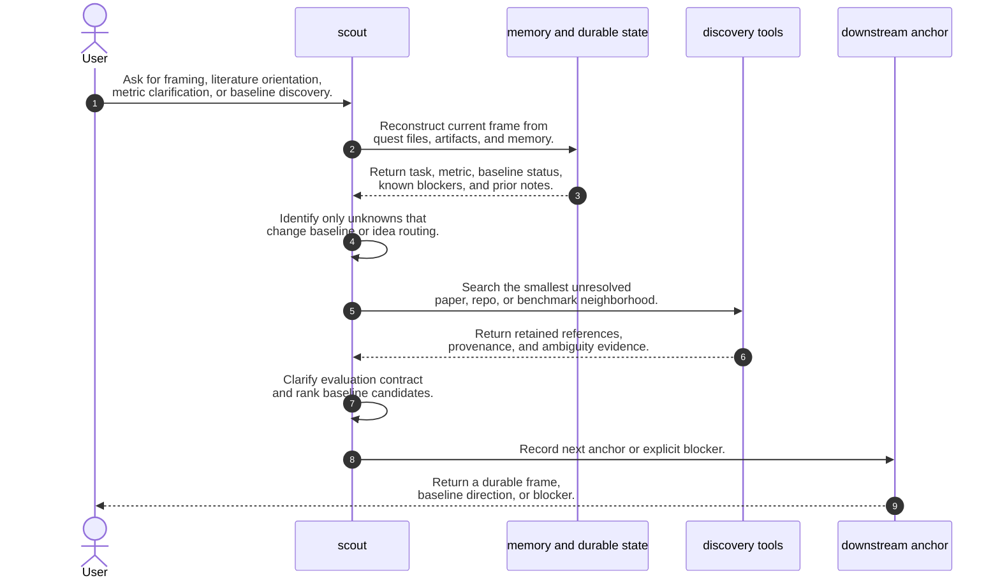
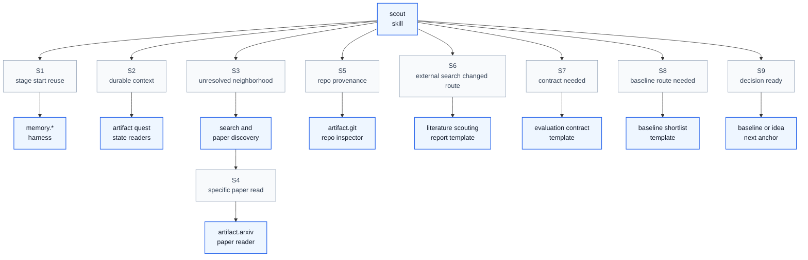

# Scout Skill Process

## Purpose

This note explains how the upstream DeepScientist `scout` skill operates as a skill process. It aligns `extern/orphan/DeepScientist/src/skills/scout/SKILL.md` and its directly linked reference pages that affect runtime behavior.

The key orchestration rule is: `scout` resolves only the minimum framing unknowns that change the next anchor, records a durable frame or blocker, and stops before exploration becomes an open-ended literature survey.

## File Inventory

| Relative Path | Category | Purpose |
| --- | --- | --- |
| `SKILL.md` | Entrypoint | Defines the scout stage trigger signals, bounded control workflow, tool discipline, validation checks, blocked-state handling, and exit criteria. |
| `references/operational-guidance.md` | Reference | Expands the scout control workflow into tactical steps for reconstructing frame, reusing memory, searching, clarifying evaluation, shortlisting baselines, recommending the next anchor, and updating continuity. |
| `references/literature-scout-template.md` | Reference | Provides the durable report shape used when external search materially changes the task frame, evaluation contract, or baseline route. |
| `references/paper-triage-playbook.md` | Reference | Defines the bounded paper, repository, and benchmark triage method for mapping the smallest useful neighborhood. |
| `references/eval-contract-template.md` | Reference | Provides the durable evaluation contract template for task, dataset, split, metric, fairness, evidence, ambiguities, and decision impact. |
| `references/baseline-shortlist-template.md` | Reference | Provides the durable baseline shortlist template for candidate scoring, route choice, risk, and recommendation. |

## Concepts

- **Scout stage**: The source stage that owns problem framing, metric clarification, literature orientation, benchmark neighborhood mapping, and baseline direction before heavier stages run.
- **Quest**: The source execution context whose durable files, artifacts, memory, and state supply current research context.
- **Current frame**: The explicit statement of task, dataset and split understanding, metric contract, baseline status, and blockers.
- **Minimum unknowns**: Only the unresolved questions that materially affect whether the next anchor should be `baseline`, `idea`, or continued `scout`.
- **Evaluation contract**: The task, dataset, split, metric, comparison rule, useful-improvement threshold, evidence, ambiguity, and decision-impact record needed by downstream stages.
- **Baseline shortlist**: A small decision-facing set of comparator candidates scored by provenance, metric and split compatibility, implementation availability, reproduction or import cost, downstream value, and recommended route.
- **Next anchor**: The next source stage or stop state after scouting, normally `baseline`, `idea`, or an explicit blocked `scout` state.
- **Literature scouting report**: The durable search ledger and retained-reference report required when external discovery changes the frame or route.
- **Memory reuse**: The stage-start and stage-end use of `memory.list_recent(...)`, `memory.search(...)`, and `memory.write(...)` to avoid repeating known scouting work and preserve reusable conclusions.
- **Artifact harness**: The source DeepScientist harness surfaces such as `artifact.read_quest_documents(...)`, `artifact.get_quest_state(...)`, `artifact.git(...)`, and `artifact.arxiv(...)` used for durable context, repository inspection, and paper reading.
- **DeepXiv route**: An optional paper-centric discovery and shortlist triage route preferred when the system prompt declares DeepXiv available.
- **Blocked scout result**: A stop state that names what is missing, why it matters, which next anchor is blocked, and the concrete user choice or source needed.

## High Level Process



## Skill Call Graph

This graph shows the source skill's runtime routing relationships and harness expectations. Reference files are included only where they define runtime workflow surfaces or durable output shapes.



| ID | Caller | Route | Callee | Calling condition |
| --- | --- | --- | --- | --- |
| S1 | `scout` | Stage-start and stage-end memory reuse | `memory.list_recent`, `memory.search`, `memory.write` | Scout begins by checking recent quest memory and at least one scout-relevant memory search before broad search, then writes memory when it produces a reusable conclusion. |
| S2 | `scout` | Durable quest context | `artifact.read_quest_documents`, `artifact.get_quest_state`, durable quest files | Scout needs the current task, metric contract, baseline status, blockers, and existing notes before external search. |
| S3 | `scout` | Unresolved paper, repo, or benchmark neighborhood | Search tooling or DeepXiv when available | Local evidence is insufficient and unresolved ambiguity can change the next anchor. |
| S4 | `scout` | Specific paper read | `artifact.arxiv(paper_id=..., full_text=False)` | A specific arXiv paper must be read or summarized after discovery. |
| S5 | `scout` | Repository provenance | `artifact.git(...)` before raw shell git | A candidate paper or baseline repository must be inspected for official linkage, evaluation path, dependency realism, or maintainability. |
| S6 | `scout` | External search changed route | `references/literature-scout-template.md` | External search materially changes the frame, evaluation contract, or baseline shortlist. |
| S7 | `scout` | Evaluation contract needed | `references/eval-contract-template.md` | Dataset, split, metric, fairness, useful-improvement threshold, evidence, or ambiguity must become durable. |
| S8 | `scout` | Baseline route needed | `references/baseline-shortlist-template.md` | Scout must recommend attach, import, reproduce, or reject routes for serious comparator candidates. |
| S9 | `scout` | Decision-ready next anchor | `baseline`, `idea`, or blocked `scout` | Task frame, evaluation contract, and baseline direction are explicit enough, or a blocker is concrete enough to stop guessing. |

## Formal Skill Process

```python
@skill(
    name="scout",
    description="Frame a quest enough to choose baseline, idea, or a blocked stop state.",
)
def run_scout(user_request: str, quest_context: object) -> StageResult:
    # Entry point purpose: make the research frame concrete enough for the next heavier stage.
    # Example input: user_request="find the right baseline and metric for this resumed quest"
    # Example output: StageResult(status="ready", evidence=["evaluation contract", "baseline shortlist"], next_action="baseline")

    entry_fit = agent_check(
        "Does the quest still have framing ambiguity that blocks baseline, idea, or both?",
        context={"user_request": user_request, "quest_context": quest_context},
        returns=bool,
        rubric="True when task, dataset, split, metric, paper neighborhood, or baseline direction is not stable enough to choose the next anchor.",
    )
    if not entry_fit:
        # Condition matched when the durable frame is already stable and the next stage is obvious.
        return StageResult(status="skipped", next_action="route to the already obvious next anchor")

    recent_memory = agent_invoke(
        "memory.list_recent",
        task="List recent quest memory before broad scout search.",
        context={"scope": "quest", "limit": 5},
        returns=StageResult,
    )
    memory_hits = agent_invoke(
        "memory.search",
        task="Search current task, benchmark, dataset, metric, split, and likely baseline names before broad scout search.",
        context={"quest_context": quest_context, "recent_memory": recent_memory},
        returns=StageResult,
    )
    durable_frame = agent_do(
        "Reconstruct the current task, dataset and split understanding, metric contract, baseline status, and blockers from durable quest state and memory.",
        context={"quest_context": quest_context, "recent_memory": recent_memory, "memory_hits": memory_hits},
        returns=StageResult,
    )
    if durable_frame.status in {"blocked", "failed"}:
        return durable_frame

    unknowns = agent_do(
        "List only unknowns that materially affect baseline, idea, both, or non-blocking future detail.",
        context=durable_frame,
        returns=list,
        constraints="Exclude nice-to-know facts that do not change the next stage.",
    )
    if len(unknowns) == 0:
        # Condition matched when memory and durable files already make the next anchor clear.
        return StageResult(status="ready", evidence=["current frame"], next_action="baseline or idea")

    search_needed = agent_check(
        "Do unresolved unknowns require external paper, repository, benchmark, or provenance search?",
        context={"unknowns": unknowns, "durable_frame": durable_frame},
        returns=bool,
        rubric="True only when local evidence cannot resolve an unknown that changes the next anchor.",
    )
    if search_needed:
        discovery = agent_do(
            "Search the smallest unresolved paper, repository, or benchmark neighborhood that can change the next anchor.",
            context={"unknowns": unknowns, "truth_sources": "user constraints, durable files, code docs, primary papers, official repos, benchmark docs, baselines, memory, web search"},
            returns=StageResult,
            constraints=[
                "Prefer DeepXiv for paper-centric discovery when available.",
                "Use artifact.arxiv for actual arXiv paper reading.",
                "Search for disconfirming evidence as well as supportive evidence.",
                "Stop when additional papers no longer change the next action.",
            ],
        )
        if discovery.status in {"blocked", "failed"}:
            return discovery
    else:
        discovery = StageResult(status="skipped", evidence=["no external search needed"])

    evaluation_contract = agent_do(
        "Create or update the evaluation contract: task, dataset, split, primary metric, useful-improvement threshold, fair-comparison rule, evidence, ambiguity, and decision impact.",
        context={"durable_frame": durable_frame, "unknowns": unknowns, "discovery": discovery},
        returns=StageResult,
    )
    if evaluation_contract.status in {"blocked", "failed"}:
        return evaluation_contract

    baseline_shortlist = agent_do(
        "Score serious baseline candidates and recommend attach, import, reproduce, or reject for each.",
        context={"evaluation_contract": evaluation_contract, "discovery": discovery},
        returns=StageResult,
        constraints="Keep the shortlist small, provenance-aware, and decision-facing.",
    )
    if baseline_shortlist.status in {"blocked", "failed"}:
        return StageResult(
            status="blocked",
            evidence=evaluation_contract.evidence,
            blockers=baseline_shortlist.blockers,
            next_action="remain in scout until the baseline blocker is concrete or user-resolved",
        )

    next_anchor = agent_select(
        ["baseline", "idea", "blocked scout"],
        criterion="Choose baseline unless a trustworthy baseline is already durable enough for ideation, and choose blocked scout only when missing sources or conflicting contracts would change conclusions.",
        context={"evaluation_contract": evaluation_contract, "baseline_shortlist": baseline_shortlist},
    )

    if discovery.status != "skipped":
        literature_report = agent_do(
            "Record a durable literature scouting report with search ledger, retained references, evaluation implications, baseline implications, and next anchor.",
            context={"discovery": discovery, "evaluation_contract": evaluation_contract, "baseline_shortlist": baseline_shortlist, "next_anchor": next_anchor},
            returns=StageResult,
        )
        if literature_report.status in {"blocked", "failed"}:
            return literature_report

    memory_write = agent_invoke(
        "memory.write",
        task="Preserve reusable scout conclusion, literature lesson, baseline shortlist lesson, or metric-contract caveat.",
        context={"evaluation_contract": evaluation_contract, "baseline_shortlist": baseline_shortlist, "next_anchor": next_anchor},
        returns=StageResult,
    )

    return StageResult(
        status="ready",
        evidence=["current frame", "evaluation contract", "baseline shortlist", "literature report when external search mattered", "memory write when conclusion is reusable"],
        next_action=next_anchor,
        metadata={"memory_write": memory_write.status},
    )
```

## Skill Process Explanation

- **Entry fit.** Scout first checks whether ambiguity still blocks the next stage; if durable state already fixes paper, baseline, dataset, metric, and scope, scout should exit quickly instead of re-opening exploration.
- **Durable state reconstruction.** The stage starts from user constraints, quest files, artifacts, repository docs, memory, and existing baseline evidence so it does not ask routine questions or repeat a wide search from scratch.
- **Minimum unknown selection.** Scout narrows work to unknowns that change `baseline`, `idea`, or both; it treats nice-to-know facts as non-blocking and keeps them out of the critical path.
- **Bounded discovery.** External search is active when local evidence is insufficient, but it follows a compact ladder from direct benchmark/task neighbors to mechanism and bottleneck neighbors, and it switches to paper reading only for references that survived triage.
- **Evaluation contract.** The stage must make task, dataset, split, metric, fair comparison, useful improvement, evidence, and ambiguities explicit enough that downstream stages do not re-derive them.
- **Baseline shortlist.** Scout scores serious candidates by provenance, metric and split compatibility, implementation availability, environment risk, expected cost, downstream value, and route recommendation.
- **Next anchor selection.** The final output is a durable frame with a next anchor of `baseline`, `idea`, or blocked `scout`; the stage stops on clarity rather than search exhaustion.
- **Continuity update.** When external search or scout reasoning changes the frame, the stage records a literature report or other durable state and writes memory for reusable conclusions.

## Evidence Handoffs

| Producing skill or stage | Evidence | Consuming stage |
| --- | --- | --- |
| User and durable quest state | Task description, explicit constraints, `brief.md`, `plan.md`, `status.md`, `SUMMARY.md`, baseline artifacts, recent paper or knowledge memory cards | Frame reconstruction and entry-fit check |
| Memory reuse | Recent memory and scout-relevant memory hits for task, benchmark, dataset, metric, split, and likely baselines | Minimum unknown selection and search narrowing |
| Search and paper or repo triage | Retained references, rejected references, provenance labels, repo trust, metric and split implications | Evaluation contract, baseline shortlist, and literature scouting report |
| Evaluation contract | Task, dataset, split, metric, fairness rule, useful-improvement threshold, evidence, known ambiguities, decision impact | Baseline route, idea route, experiment planning, and blocked-state decision |
| Baseline shortlist | Candidate scores, route recommendation, risks, fallback route, and recommended baseline action | Next anchor selection and later baseline work |
| Literature scouting report | Search ledger, reference buckets, evaluation implications, baseline implications, next anchor recommendation | Later `baseline` and `idea` passes so they do not restart from zero |
| Blocked scout result | Missing source, conflict, weak baseline candidates, why it matters, blocked next anchor, and needed user choice or source | User decision or continued scout repair |
| Memory write | Reusable framing conclusion, baseline lesson, literature lesson, or metric-contract caveat | Future scout, baseline, and idea work |

## Self-Containment Check

- The document defines the important source terms needed to understand the process.
- The high-level process, call graph, formal process, and explanation agree on stage order.
- External harness calls and source routes are labeled explicitly.
- The output is one Markdown document and can be read without opening the original source files.
