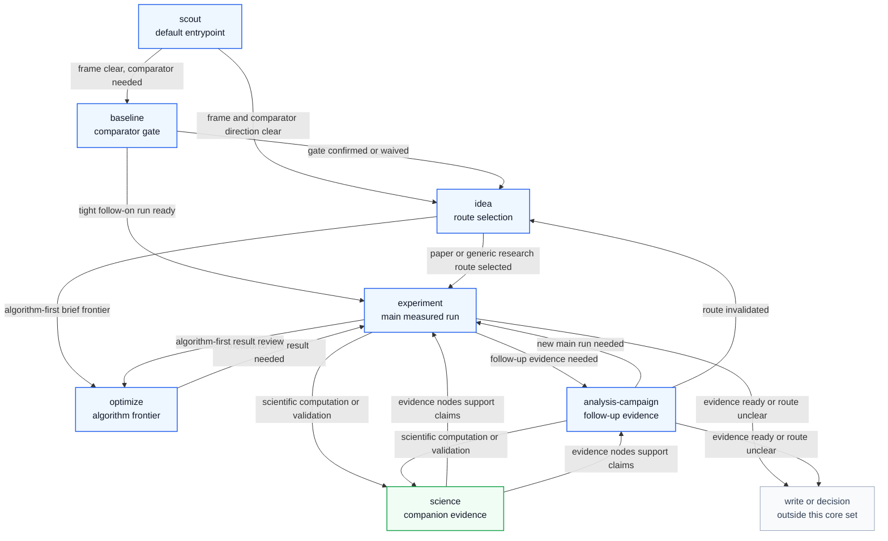

# DeepScientist Core Research Skill Process Analysis

This directory contains `imsight-agent-skill-handling deep-inspect` outputs for the core research skills listed in `context/explore/deepscientist-skill-analysis/README.md`.

Source skill root: `/home/huangzhe/workspace/code/isomer-labs/extern/orphan/DeepScientist/src/skills`

## Entrypoint And Calling Relationship

For a fresh or unclear research quest, the default entrypoint is `scout`. It reconstructs the research frame and routes to the first heavier stage that can act without guessing. If durable quest state already satisfies earlier gates, the process may start later in the chain, such as `baseline` when the frame is clear but no comparator is accepted, `idea` when the baseline is accepted but the route is unresolved, `optimize` for algorithm-first frontier work, or `experiment` when a selected idea and accepted baseline are already ready.

| From | To | When |
| --- | --- | --- |
| `scout` | `baseline` | The frame is explicit enough, but no trustworthy comparator or accepted metric contract exists. |
| `scout` | `idea` | The frame and baseline direction are clear enough to choose a research route. |
| `baseline` | `idea` | The comparator gate is confirmed or waived, and the next unresolved task is direction selection. |
| `baseline` | `experiment` | A tightly scoped follow-on run is ready after the baseline gate closes. |
| `idea` | `experiment` | One selected idea has a falsifiable hypothesis and experiment-ready handoff. |
| `idea` | `optimize` | The quest is algorithm-first and needs method-brief ranking, promotion, or frontier management. |
| `optimize` | `experiment` | A durable optimization line needs a real measured run. |
| `experiment` | `optimize` | An algorithm-first measured result needs frontier review before another run. |
| `experiment` | `analysis-campaign` | A main result exists and follow-up ablation, robustness, failure, or limitation evidence is needed. |
| `analysis-campaign` | `experiment` | Follow-up evidence shows that a new main run is the correct next move. |
| `analysis-campaign` | `idea` | Follow-up evidence weakens or invalidates the current direction. |
| `science` | `experiment` or `analysis-campaign` | Scientific computation, validation, package checks, HPC work, or Science Evidence Graph records support the measured evidence path. |

## Original Source File Inventories

Each process document includes an `Original Skill Directory Files` table that lists the files in the corresponding DeepScientist source skill directory and summarizes what each file is about.

| Source skill directory | Inventory location | File coverage |
| --- | --- | --- |
| `scout/` | [scout.md](scout.md#original-skill-directory-files) | `SKILL.md` plus 5 reference files. |
| `baseline/` | [baseline.md](baseline.md#original-skill-directory-files) | `SKILL.md` plus 9 reference files. |
| `idea/` | [idea.md](idea.md#original-skill-directory-files) | `SKILL.md` plus 13 reference files. |
| `optimize/` | [optimize.md](optimize.md#original-skill-directory-files) | `SKILL.md` plus 13 reference files. |
| `experiment/` | [experiment.md](experiment.md#original-skill-directory-files) | `SKILL.md` plus 5 reference files. |
| `analysis-campaign/` | [analysis-campaign.md](analysis-campaign.md#original-skill-directory-files) | `SKILL.md` plus 7 reference files. |
| `science/` | [science.md](science.md#original-skill-directory-files) | `PROVENANCE.md`, `SKILL.md`, 7 core reference files, and 169 package-card files. |

## Core Research Skills

| Skill | Process document |
| --- | --- |
| `scout` | [scout.md](scout.md) |
| `baseline` | [baseline.md](baseline.md) |
| `idea` | [idea.md](idea.md) |
| `optimize` | [optimize.md](optimize.md) |
| `experiment` | [experiment.md](experiment.md) |
| `analysis-campaign` | [analysis-campaign.md](analysis-campaign.md) |
| `science` | [science.md](science.md) |

## Inspection Notes

Each document aligns the target `SKILL.md`, its directly linked workflow references, and the existing compact analysis report under `context/explore/deepscientist-skill-analysis/`. The `science` inspection treats package cards as progressive-disclosure routing material and inspects the package index and public science references rather than expanding all 169 package cards.
