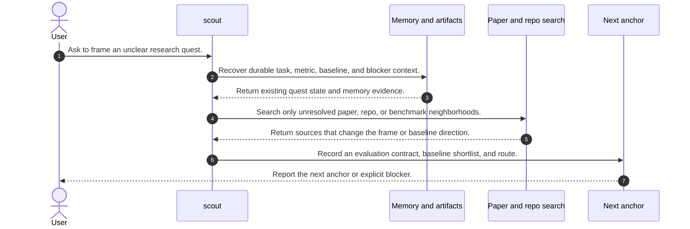
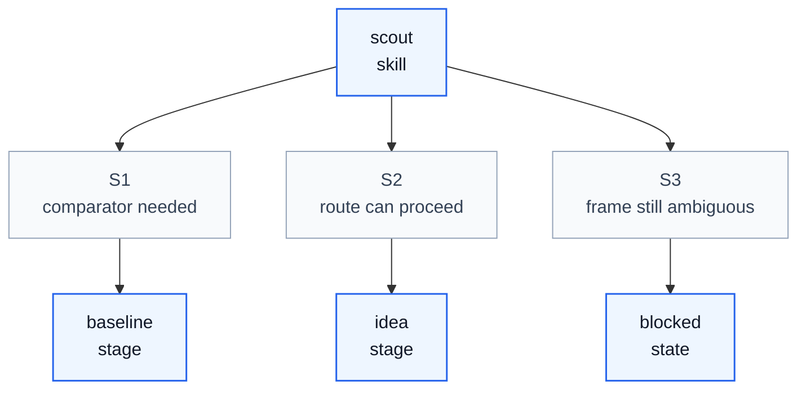

# Scout Skill Process

## Purpose

This note explains how `scout` operates as a skill process. It aligns `/home/huangzhe/workspace/code/isomer-labs/extern/orphan/DeepScientist/src/skills/scout/SKILL.md`, its paper-triage, literature-scout, evaluation-contract, baseline-shortlist, and operational-guidance references, and the compact workflow report in `context/explore/deepscientist-skill-analysis/scout.md`.

The key orchestration rule is: `scout` owns frame reconstruction and minimum-unknown discovery, then stops as soon as it can durably route to `baseline`, `idea`, or an explicit blocker.

## Original Skill Directory Files

| File | What it is about |
| --- | --- |
| `SKILL.md` | Main `scout` skill definition, match signals, workflow, constraints, validation, tool discipline, and exit criteria. |
| `references/baseline-shortlist-template.md` | Template for decision-facing baseline candidate summaries and recommendation. |
| `references/eval-contract-template.md` | Template for task, dataset, split, metric, evidence, ambiguity, and decision-impact fields. |
| `references/literature-scout-template.md` | Template for a literature scouting report with search ledger, reference buckets, implications, and next-anchor recommendation. |
| `references/operational-guidance.md` | Detailed scout workflow for frame reconstruction, unknown selection, search, memory use, artifact use, and stop rules. |
| `references/paper-triage-playbook.md` | Playbook for paper and repo triage, source ordering, useful-reference retention, and search stop conditions. |

## Concepts

- **Task Frame**: The current statement of objective, scope, dataset, metric, baseline status, and blockers that determines whether heavier research stages can begin.
- **Minimum Unknowns**: The smallest unresolved facts that materially block `baseline`, `idea`, or both.
- **Evaluation Contract**: The task, dataset, split, metric, direction, and evidence expectations that later comparison work must preserve.
- **Baseline Shortlist**: A small decision-facing set of comparator directions, not a broad literature dump.
- **Next Anchor**: The stage that should own the next meaningful work, usually `baseline`, `idea`, or a blocked scout state.
- **DeepXiv or Paper Discovery Route**: An optional paper-centric discovery path used when the runtime declares it available, otherwise replaced by memory, web discovery, and `artifact.arxiv(...)`.

## High Level Process



## Skill Call Graph



| ID | Caller | Route | Callee | Calling condition |
| --- | --- | --- | --- | --- |
| S1 | `scout` | comparator needed | `baseline` | A task frame and evaluation contract are clear enough, but no trustworthy comparator is accepted. |
| S2 | `scout` | route can proceed | `idea` | Baseline direction and evaluation surface are clear enough for direction selection. |
| S3 | `scout` | frame still ambiguous | blocked state | Objective, source, evaluation contract, or baseline candidates remain too ambiguous to route honestly. |

## Formal Skill Process

```python
@skill(
    name="scout",
    description="Frame an unclear research quest and route to the next anchor.",
)
def run_scout(user_request: str, quest_root: Path | None = None) -> StageResult:
    frame = agent_do(
        "Reconstruct the current task frame from user constraints, quest files, artifacts, and memory.",
        context={"user_request": user_request, "quest_root": quest_root},
        returns=StageResult,
    )
    if frame.status in {"blocked", "failed"}:
        # Condition matched when durable quest state or required sources are missing.
        return frame

    unknowns = agent_do(
        "Identify only the unknowns that materially block baseline or idea work.",
        context={"frame": frame},
        returns=StageResult,
    )
    route = agent_select(
        ["reuse_state", "targeted_search", "read_shortlisted_papers"],
        criterion="Choose the lightest action that can resolve the minimum unknowns.",
        context={"frame": frame, "unknowns": unknowns},
    )

    evidence = agent_do(
        "Use memory, local evidence, search tooling, and artifact.arxiv only as needed to resolve the chosen unknowns.",
        context={"route": route, "unknowns": unknowns},
        returns=StageResult,
    )
    if evidence.status in {"blocked", "failed"}:
        # Condition matched when sources, paper access, or evaluation choices cannot be resolved.
        return evidence

    contract = agent_do(
        "Write or refresh the evaluation contract and baseline shortlist with decision-facing evidence.",
        context={"frame": frame, "evidence": evidence},
        returns=StageResult,
    )
    next_anchor = agent_select(
        ["baseline", "idea", "blocked"],
        criterion="Choose the next anchor that can now act without guessing.",
        context={"contract": contract},
    )
    return agent_do(
        "Record the next anchor or blocker and stop scouting on clarity.",
        context={"next_anchor": next_anchor, "contract": contract},
        returns=StageResult,
    )
```

## Skill Process Explanation

- **Frame Recovery.** `scout` starts by reading durable quest documents, artifacts, memory, codebase context, and user constraints so it does not ask ordinary technical questions before checking available evidence.
- **Unknown Filtering.** The skill narrows ambiguity to facts that change whether `baseline` or `idea` should run next, which prevents endless survey behavior.
- **Targeted Discovery.** Search tools, DeepXiv when declared available, web discovery, and `artifact.arxiv(...)` are used only for paper or repo evidence that can change the next anchor.
- **Contract And Shortlist.** The durable output is an evaluation contract plus a baseline shortlist or route justification, not long paper summaries.
- **Route Closeout.** `scout` exits once the next anchor is clear or the blocker is explicit enough to stop guessing.

## Evidence Handoffs

| Producing skill or stage | Evidence | Consuming stage |
| --- | --- | --- |
| `scout` frame recovery | Explicit task frame with objective, dataset, metric, baseline status, and blockers. | `scout` unknown filtering |
| `scout` targeted discovery | Literature, repo, benchmark, or arXiv evidence tied to unresolved frame gaps. | `scout` contract writing |
| `scout` contract writing | Evaluation contract and baseline shortlist. | `baseline` or `idea` |
| `scout` closeout | Explicit next anchor or blocked state. | Quest controller or next research stage |
