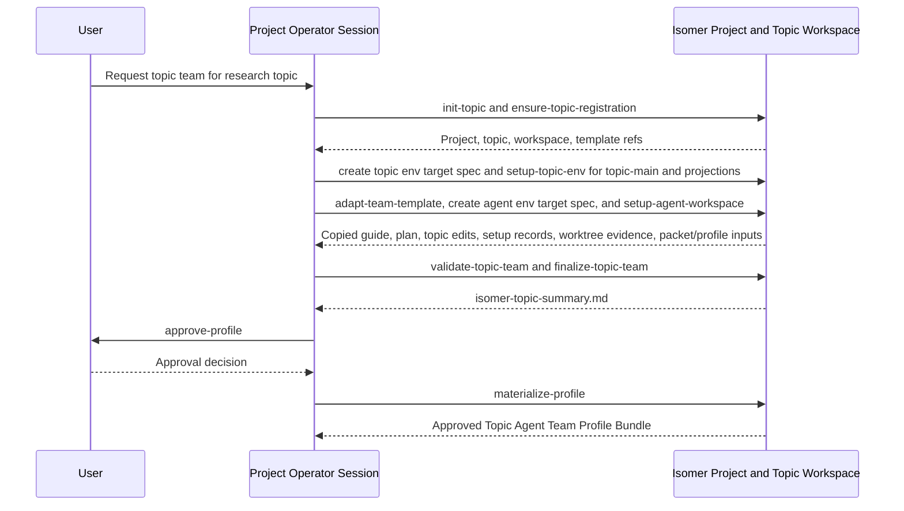
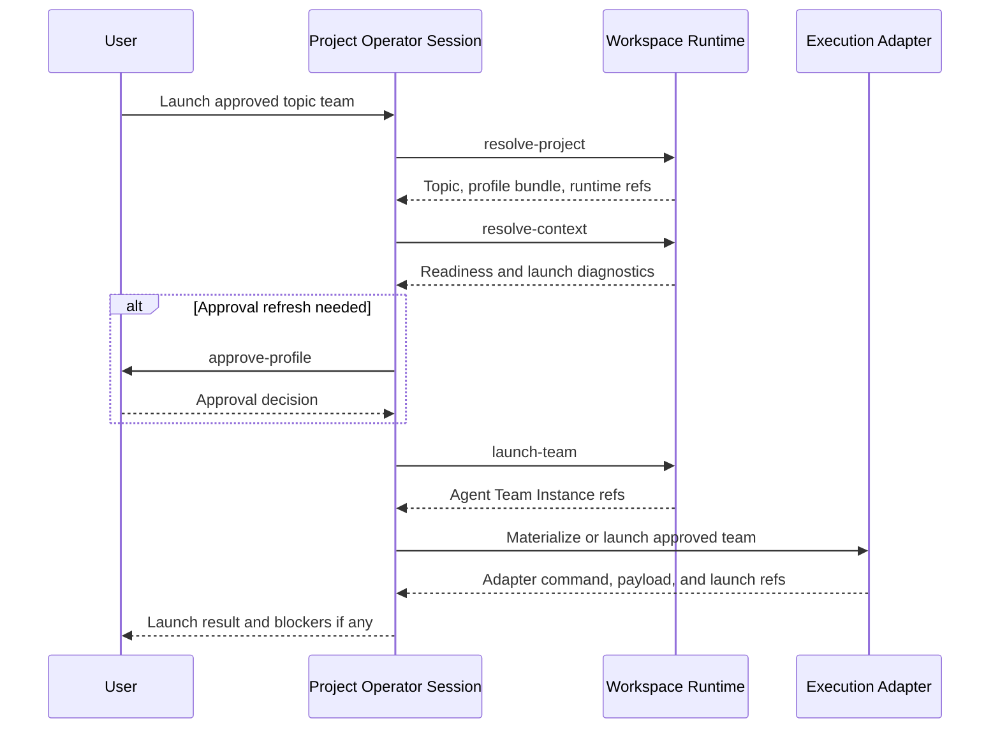

# Operator Admin Skills

This subtree contains skills intended for Project Operator Sessions and Operator Agents. Operator skills use the `isomer-op-<purpose>` naming convention because they operate project control surfaces: project discovery, topic creation, human-orchestrated Topic Actor setup, Topic Team Specialization orchestration, approval provenance, profile materialization, and team launch orchestration.

Install these skills into the agent surface that acts as the Project Operator Session or durable Operator Agent. Ordinary research team members should use research-stage skills from `skillset/research-paradigm/`; Service Team actors should use service skills from `skillset/service/`.

## Skill Purposes

| Skill | Purpose |
| --- | --- |
| `isomer-op-entrypoint` | Route informed user tasks to the correct Isomer system skill or CLI surface, then proceed with the selected route. It indexes operator, service, misc, DeepSci and Kaoju extension, and Isomer CLI surfaces while preserving owner boundaries; `isomer-op-welcome` remains the read-only welcome menu and path chooser. |
| `isomer-op-welcome` | Manual invocation only. Show the grouped Isomer Labs capability menu and route users to an active owner, optional research paradigm, or informed entrypoint. It exposes manual and formal Agent Team execution paths, DeepSci and Kaoju research paths, read-only extension discovery, Project and Topic operations, GUI and identity routes, system-skill extension management, and project-local Toolbox customization while keeping mutation outside the welcome surface. |
| `isomer-op-project-mgr` | Run the operator Project lifecycle workflow. It exposes short local subcommands such as `help`, `init-project`, `check-project`, `list-topics`, `show-context`, `init-runtime`, `prep-runtime`, `prepare-topic`, `manual-research`, and `specialize-team`; it initializes `.isomer-labs/` and the Isomer-managed `.isomer-labs/.houmao/` overlay through `isomer-cli project init`, checks Project health, resolves context, prepares runtime, routes blank-state topic creation and manual-research setup to `isomer-op-topic-creator`, and hands full topic-team specialization to `isomer-op-topic-team-specialize fast-forward`. |
| `isomer-op-system-skill-mgr` | Detect, reconcile, install, inspect, and repair optional Isomer system-skill extensions from the current operator host. It trusts Project declarations first, inspects only host-supplied roots through versioned internal CLI primitives, falls back to the live skill inventory, performs additive registration in authorized workflows, and reports refresh requirements. |
| `isomer-op-switch-identity` | Switch the Project Operator's working identity posture to a selected Topic Actor or Agent. It resolves `topic.actors.workspace` or `agent.workspace`, uses that worker workspace as command cwd, supports one-task switches, one-prompt `act-as`, persistent session switches, `status`, and `reset`, and preserves provenance that the Project Operator acted as or on behalf of the selected identity. |
| `isomer-op-toolbox-mgr` | Create and manage project-local Toolboxes. It authors Toolbox source under `skillset/toolboxes/<toolbox-id>/`, converts existing skills into Toolbox callback material, inserts callbacks at declared insertion points, defines Runtime Params, and uses existing `isomer-cli project toolboxes`, `project skill-callbacks`, and `project toolbox-params` surfaces for validation, install, mutation, and inspection. |
| `isomer-op-topic-creator` | Create or resume a Research Topic from empty or partial Project state to a prepared Topic Workspace with a readiness summary. It defaults ordinary topic creation requests to `run-to finalize` with `finalize` included unless the user explicitly asks for `fast-forward`, fully automatic execution, `step-by-step`, manual lower-level control, `run-to`, stop-before/exclusion behavior, or another named mode. It exposes commands such as `help`, `fast-forward`, `step-by-step`, `run-to`, `ensure-project`, `resolve-topic-input`, `register-topic`, `init-runtime`, `create-research-intent`, `define-topic-env`, `setup-topic-env`, `define-actors`, `setup-actors`, `finalize`, `status`, and `repair`; it delegates Project lifecycle to `isomer-op-project-mgr`, topic environment setup to `isomer-srv-topic-env-setup`, and Topic Actor topology to `isomer-op-topic-mgr`. |
| `isomer-op-topic-team-specialize` | Run the module-level Topic Team Specialization workflow. It exposes procedural subcommands from `init-topic` through `finalize-topic-team`, five helper subcommands for lower-level specialization work, and misc commands such as `help`, `step-by-step`, and `fast-forward`; it creates `topic.intent.overview`, resolves topic and agent environment intent, creates or validates derived topic and agent target specs, copies and adapts Domain Agent Team Template material under `<topic-workspace>/team-profile/`, orchestrates Topic Workspace predecessor setup through service skills, delegates per-agent worktree and cwd proof to agent env setup when requested, validates readiness, writes `isomer-topic-summary.md`, and keeps approval, materialization, and launch as explicit boundaries. |
| `isomer-op-topic-mgr` | Manage an initialized Research Topic after Topic Creator handoff. It exposes scoped commands for `status`, storage, Topic Actors, topic agent team topology, package install/update/remove mutation, environment verification routing, boundary notes, and diagnostics. Canonical Topic Main Development Repository setup belongs to `isomer-srv-topic-env-setup`; canonical per-agent worktree creation and cwd proof belong to `isomer-srv-agent-env-setup`; production DeepSci research bootstrap belongs to `isomer-deepsci-workspace-mgr`. |

## Example: Initialize and Check a Project

Use this flow when a user asks the operator to create, diagnose, or prepare an Isomer Project before topic-team work.

1. The operator can ask `isomer-op-project-mgr init-project` to run the supported Project bootstrap path. Successful `isomer-cli project init` creates `.isomer-labs/`, the selected generated content root, and the Isomer-managed `.isomer-labs/.houmao/` overlay. Root `.houmao/` is external user-owned Houmao state if present. Research Topics and Topic Workspaces are created later through `isomer-cli project topics create`.
2. If the user wants usage information, call `isomer-op-project-mgr help`; invoking `isomer-op-project-mgr` without a prompt defaults to the same help output.
3. If the Project already exists, call `check-project` to run read-only Project validation, doctor diagnostics, and Houmao Project status checks.
4. Use `list-topics` and `show-context` to inspect registered Research Topics, Topic Workspaces, defaults, selected profile refs, and selected template refs.
5. Use `init-runtime` and `prep-runtime` only when the user explicitly wants Workspace Runtime state and launch-facing readiness.
6. When the user asks to create, prepare, or start a Research Topic for manual or future research work without choosing a mode, call `isomer-op-topic-creator run-to finalize`; the `finalize` target is included by default. Use `fast-forward` only when the user explicitly asks for automatic or fast-forward setup, use `step-by-step` when the user asks for guided acknowledgement, and use explicit wording such as `stop before finalize` when the user wants exclusion.
7. When the user asks for a narrow Project-only route, `prepare-topic` and `manual-research` hand off to `isomer-op-topic-creator`.
8. Call `specialize-team` only when the user explicitly invokes specialization or asks to deploy, specialize, instantiate, materialize, validate, repair, launch, or use a formal Agent Team established by the prompt or authoritative context. It resolves Project context and hands off to `isomer-op-topic-team-specialize fast-forward` rather than to the internal `adapt-team-template` stage. Generic topic preparation, launch-facing work, readiness gaps, missing summaries, and missing Agent Workspaces do not establish Agent Team intent.

## Example: Route an Informed User Task

Use `isomer-op-entrypoint` when the user gives a concrete Isomer task, prompt, file, topic, actor, agent, DeepSci request, or CLI-shaped action and wants the Project Operator to choose the correct surface.

1. The entrypoint parses the input surface, such as a topic brief, existing topic id, Topic Actor name, Agent Name, Domain Agent Team Template, research-stage request, JSON payload, record request, or CLI command family.
2. It uses read-only context discovery such as `isomer-cli project self queries`, `isomer-cli project validate`, `isomer-cli project topics list`, `isomer-cli project context show`, or Workspace Path Resolution when context is missing.
3. It selects one route and proceeds by default: an owner operator skill, a DeepSci extension skill, or an Isomer CLI command family.
4. It keeps service skills as bounded support routes delegated by owner workflows unless the user explicitly invokes a service skill.
5. It keeps `isomer-op-welcome` as the read-only orientation menu and uses `isomer-op-entrypoint` for route-and-proceed dispatch.

## Example: Prepare Human-Orchestrated Topic Actor Research

Use this flow when a user wants to do research manually or with multiple manually controlled agents without first launching a formal Topic Agent Team.

1. Call `isomer-op-topic-creator run-to finalize` by default for ordinary topic creation requests; it includes `finalize` and writes `topic.workspace.summary` when prerequisites and approvals are available. Use `step-by-step` when the user explicitly wants guided acknowledgement before each step, `fast-forward` when the user has explicitly approved automatic mutation, or `run-to <procedural-subcommand>` when the user wants to prepare through a specific stage. Use `before <target>`, `stop before <target>`, `excluding <target>`, or `up to but not including <target>` to stop short of a target.
2. The creator ensures or delegates Project initialization, topic definition, Research Topic and Topic Workspace registration, Workspace Runtime readiness, topic environment setup, and `topic.repos.main` readiness.
3. The creator creates or reuses the default reserved `operator` Topic Actor Workspace unless the user explicitly opts out, and it sets up additional requested actors such as `claude-scout`, `codex-exp-a`, or `houmao-writer-a`.
4. The creator delegates actor registration, materialization, repair, and diagnostics to `isomer-op-topic-mgr` through `project topic-actors ...`.
5. The creator gives each manually controlled worker its own `topic.actors.workspace` cwd, validates actor onboarding evidence, and writes `topic.workspace.summary` with ready, verified, skipped, and blocked state. `topic.repos.main` remains the Git anchor and integration surface, not the required shared cwd for every worker.

## Example: Specialize a Domain Team for a New Topic

Use this flow when a user gives a research topic and asks the operator to instantiate a topic-level team from a Domain Agent Team Template such as `deepsci-mini`.

1. The operator can ask `isomer-op-topic-team-specialize init-topic` to turn a new research topic idea into `topic.intent.overview` at the resolved Topic Workspace intent path. If the topic already exists in the Project Manifest, the skill can use the registered Research Topic and Topic Workspace instead.
2. If the user wants usage information, call `isomer-op-topic-team-specialize help`; invoking `isomer-op-topic-team-specialize` without a prompt defaults to the same help output.
3. The normal procedural flow is `resolve-project`, `resolve-topic-intent`, `ensure-topic-registration`, `resolve-topic-env-gate`, create or validate `topic.env.topic_setup_target_spec`, `setup-topic-env`, `adapt-team-template`, optional `clarify-topic-team`, `resolve-agent-env-gate`, create or validate `topic.env.agent_setup_target_spec`, `setup-agent-workspace`, `validate-topic-team`, and `finalize-topic-team`. Direct requests like `specialize <team-path> over topic <topic>` route to `fast-forward`, which runs this path automatically where possible. `finalize-topic-team` writes `isomer-topic-summary.md` with the topic team, goal, working logic, environment setup, Agent Workspace layout, validation status, blockers, and next actions.
4. If the user wants guided specialization, call `step-by-step`; it follows the same required path as `fast-forward` but explains each step and waits for user confirmation before continuing.
5. If the user wants manual lower-level work, call one helper subcommand at a time, such as `resolve-project`, `inspect-template`, `resolve-context`, `map-placeholders`, or `draft-profile`.
6. If the user explicitly approves continuing past finalization, the same skill's local `approve-profile`, `materialize-profile`, and `launch-team` subcommands handle approval provenance, validated bundle writing, and launch-facing runtime or adapter work.
7. The operator reports topic overview path, copied material paths, packet/profile inputs, environment status, Agent Workspace paths, validation refs, summary path, and blockers.

For Topic Workspace environment setup, `setup-topic-env` creates or validates `topic.env.topic_setup_target_spec`, delegates to `isomer-srv-topic-env-setup`, and records Topic Workspace, Topic Main Development Repository, and projection predecessor evidence, not per-agent cwd proof. For Topic Actor Workspace setup, delegate Topic Actor registration, materialization, repair, archive, and actor-scoped diagnostics to `isomer-op-topic-mgr`. For Agent Workspace setup, `setup-agent-workspace` creates or validates `topic.env.agent_setup_target_spec` and delegates per-agent worktree creation plus cwd proof to `isomer-srv-agent-env-setup` only after topic env predecessor evidence, Topic Main Development Repository predecessor evidence, required projection predecessor evidence, and authoritative Agent Names exist.

## Example: Launch an Approved Topic Team

Use this flow when a Topic Agent Team Profile Bundle already exists and the user asks the operator to create or launch the topic's runtime team.

1. `resolve-project` and `resolve-context` resolve the selected Research Topic, Topic Workspace, approved profile bundle, Workspace Runtime, and launch-relevant adapter refs.
2. The local `approve-profile` subcommand refreshes approval when the existing bundle has stale approval, unresolved launch blockers, or requires a fresh user decision before launch.
3. The local `launch-team` subcommand creates or selects the Agent Team Instance, preserves profile bundle and packet provenance, and routes adapter launch materialization.
4. The operator reports runtime refs, adapter refs, launch diagnostics, launch blockers, and the next operator action to the user.

## Example: Route Houmao Support During Topic Team Work

Use this flow when a topic-team specialization or formal Agent Team launch task touches Houmao-managed agents. A generic launch task without a formal Agent Team target retains its actual runtime, Topic Service Master, GUI, topic, or service owner.

1. Keep the visible first command on the operator workflow that owns the user request, usually `isomer-op-topic-team-specialize` for Topic Team Specialization or `isomer-op-project-mgr` for Project bootstrap and checks.
2. When the operator workflow needs Houmao loop explanation, adapter customization guidance, Domain Agent Team Template mapping, mailbox or gateway inspection, or runtime inspection, route that bounded support to `isomer-srv-houmao-interop`.
3. Treat `isomer-srv-houmao-interop` as Service Team support. It may explain concepts, identify files, list commands, and inspect runtime state, but it does not own approval, profile materialization, Agent Team Instance launch orchestration, Gate decisions, or research task routing.
4. Preserve the guardrails: keep Houmao as the adapter/implementation layer, do not edit the Houmao source checkout for Isomer behavior, and do not launch from template source without an approved Topic Agent Team Profile Bundle.

## Naming Contract

Operator skill folders must be named `isomer-op-<purpose>`, and `SKILL.md` frontmatter `name:` must match the folder name. If present, `agents/openai.yaml` must use the same skill name for `interface.display_name` and invoke the same skill in `interface.default_prompt`.

Operator skills must preserve Isomer domain boundaries. They can direct validation, approval, materialization, and launch orchestration, but they must not bypass Isomer validators, Gates, Workspace Runtime recording, or adapter preflight.

`isomer-op-project-mgr` is the canonical entrypoint for Project lifecycle operations before topic work. It owns Project bootstrap, Project checks, topic and workspace listing, context inspection, runtime initialization, readiness preparation, and routing to topic creation, manual research setup, or formal topic-team adaptation.

`isomer-op-entrypoint` is the informed-user dispatcher for concrete prompts, files, topic tasks, actor or agent tasks, DeepSci extension work, and CLI-shaped operations. It indexes operator, service, misc, extension, and Isomer CLI surfaces, selects the smallest correct owner route, and proceeds by default while preserving owner boundaries.

`isomer-op-switch-identity` is the canonical Project Operator surface for acting from a selected Topic Actor or Agent workspace cwd. It changes the operator's working posture only; it does not prove OS-level impersonation, independent Topic Actor process execution, launched Agent Instance execution, Houmao launch, or Execution Adapter execution.

`isomer-op-topic-creator` is the canonical user-facing entrypoint for topic initialization. It owns the happy path from empty or partial Project state to prepared Topic Workspace readiness summary and delegates lower-level mutation to the existing owner skills and CLI surfaces.

`isomer-op-topic-team-specialize` is the canonical entrypoint for Domain Agent Team Template understanding and topic adaptation. Its local subcommands are the normal implementation path. Do not add standalone operator skills for project awareness, template inspection, topic context resolution, placeholder reconciliation, topic profile drafting, profile review approval, profile materialization, or team launch orchestration unless a future OpenSpec change explicitly reverses the consolidation.

`isomer-op-topic-mgr` is the entrypoint for initialized-topic management after Topic Creator handoff, including storage inspection, Topic Actor CRUD, Topic Actor Workspace materialization or repair, actor-scoped path diagnostics, topic agent team topology inspection, branch helper operations, package install/update/remove requests, environment verification routing, Workspace Boundary summaries, manual topology operations, and diagnostics. It is not the canonical creator of the Topic Main Development Repository, normal per-agent worktrees, or production DeepSci research bootstrap outputs.

Houmao-specific explanation, adapter customization guidance, template mapping, mailbox or gateway inspection, and runtime inspection are bounded service support. Route that support to `isomer-srv-houmao-interop` from the owning operator workflow instead of adding or invoking a standalone operator skill.
