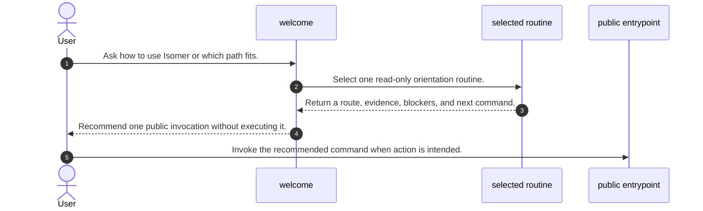
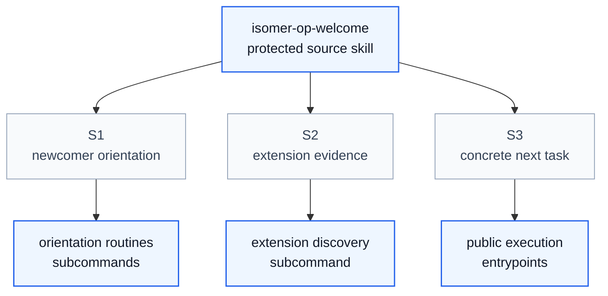

# Isomer Operator Welcome Skill Process

## Purpose

This note explains the pre-migration `isomer-op-welcome` process captured under `org/src/`. The source was a protected child of `isomer-op-entrypoint`; it provided a read-only menu, compared research topology and paradigms, inspected extension evidence, and recommended the next owner route without executing mutation.

The key orchestration rule was: welcome owned orientation and recommendation, while the public entrypoint and its selected owner retained all mutation, prerequisite recovery, Gate, and terminal-output responsibility.

## File Inventory

| Relative Path | Category | Resource Owner | Purpose |
| --- | --- | --- | --- |
| `SKILL.md` | Entrypoint | `isomer-op-welcome` | Routed ten peer read-only routines and defined output and mutation boundaries. |
| `agents/openai.yaml` | Agent config | `isomer-op-welcome` | Declared version, display text, manual invocation posture, and the former parent-scoped prompt. |
| `references/choose-path.md` | Subcommand | `isomer-op-welcome` | Compared topology, paradigm, extension, and operator routes for one recommendation. |
| `references/help.md` | Subcommand | `isomer-op-welcome` | Listed visible research paths and active operator routes. |
| `references/next-step.md` | Subcommand | `isomer-op-welcome` | Used bounded read-only Project and extension evidence to recommend a next route. |
| `references/show-extensions.md` | Subcommand | `isomer-op-welcome` | Reported catalog, declaration, public-name, and receipt or explicit-root evidence. |
| `references/show-options.md` | Subcommand | `isomer-op-welcome` | Presented grouped newcomer paths for research, Project work, extensions, and Toolboxes. |
| `references/show-skill-map.md` | Subcommand | `isomer-op-welcome` | Mapped user intents to active parent-scoped routes and extension entrypoints. |
| `references/start-deepsci-research.md` | Subcommand | `isomer-op-welcome` | Introduced production DeepSci and its readiness boundary. |
| `references/start-kaoju-survey.md` | Subcommand | `isomer-op-welcome` | Introduced evidence-led Kaoju and its governed execution boundary. |
| `references/start-research-by-agent-team.md` | Subcommand | `isomer-op-welcome` | Explained formal Topic Team Specialization from a named template. |
| `references/start-research-manually.md` | Subcommand | `isomer-op-welcome` | Explained human-orchestrated Topic Actor setup without formal-team inference. |

## Concepts

- **Welcome**: A read-only orientation surface that interprets a goal and recommends an owner route.
- **Execution topology**: The manual Topic Actor versus formal Agent Team choice about who conducts work.
- **Research paradigm**: The independent DeepSci versus Kaoju choice about how research proceeds.
- **Evidence ladder**: The distinction among package catalog, Project declaration, observed public name, verified pack integrity, and current-session usability.
- **Owner route**: The public entrypoint or protected capability responsible for actual inspection or mutation.
- **Mutation boundary**: The rule that choosing or viewing a welcome example does not authorize its recommended action.

## High Level Process



## Skill Call Graph



| ID | Caller | Route | Callee | Calling Condition |
| --- | --- | --- | --- | --- |
| S1 | `isomer-op-welcome` | Option, path, help, or start routine | Welcome subcommand | The user needs newcomer explanation or comparison. |
| S2 | `isomer-op-welcome` | Extension inspection | `show-extensions` or `next-step` | Read-only extension evidence materially affects the recommendation. |
| S3 | `isomer-op-welcome` | Recommended public command | Core, DeepSci, or Kaoju entrypoint | The user elects to execute the separately recommended task. |

## Formal Skill Process

```python
@skill(name="isomer-op-welcome", description="Orient a newcomer and recommend one public Isomer route.")
def run_welcome(user_request: str, context: object | None = None) -> StageResult:
    route = agent_select(
        ["options", "extensions", "choose-path", "next-step", "research-start", "help"],
        criterion="Choose the narrowest read-only routine that answers the user's orientation request.",
        context={"request": user_request, "context": context},
    )
    guidance = agent_do(
        "Apply the selected welcome routine and return the recommended public invocation, prerequisites, mutation posture, blockers, and next step.",
        context={"route": route, "request": user_request, "context": context},
        returns=StageResult,
        constraints=["Perform only announced read-only inspection.", "Do not execute the recommended owner route."],
    )
    return guidance
```

## Skill Process Explanation

- **Route selection.** Welcome receives the orientation request and chooses one peer routine without loading unrelated procedure pages.
- **Bounded evidence.** Extension or Project evidence is read only when it changes the recommendation, and the source distinguishes weak observations from verified integrity.
- **Public handoff.** The result names one public command, its prerequisites and mutation posture, while execution remains a separate user-visible invocation.

## Evidence Handoffs

| Producing Skill or Stage | Evidence | Consuming Stage |
| --- | --- | --- |
| Package extension CLI | Catalog entrypoint, commands, and protected inventory | Extension orientation |
| Project extension CLI | User-controlled Project declaration | Route recommendation |
| Receipt or explicit-root inspection | Verified pack integrity and compatibility | Host-aware next-step recommendation |
| Welcome routine | Goal interpretation, public invocation, blockers, and mutation posture | User or execution entrypoint |

The diagrams, formal process, file inventory, and handoff table agree on the source's read-only route-selection boundary.
