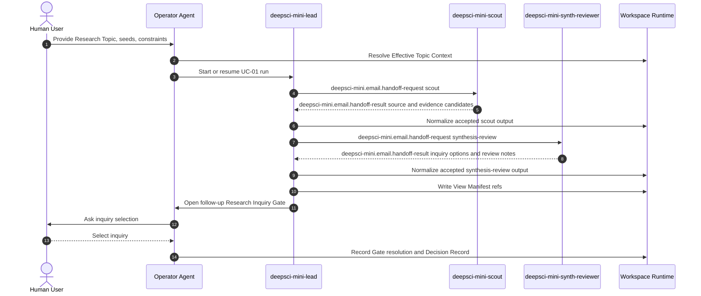

# Collaboration Overview

## Purpose

This generated process overview is the first authority for the `deepsci-mini` execplan. The loop is a manual-mode tree-loop rooted at `deepsci-mini-lead`, with two bounded specialist handoffs that support UC-01 headless research-direction exploration.

## Process Model

The loop starts from a Topic Agent Team Profile that specializes `deepsci-mini` for one Research Topic. The lead dispatches scouting work, normalizes accepted results, dispatches synthesis-review work, normalizes accepted results, opens a follow-up Research Inquiry Gate, and records the selected inquiry as a Decision Record through Isomer Workspace Runtime.

```python
def run_uc01_deepsci_mini(context):
    # Resolve topic-level identity before any team action.
    lead = participant("deepsci-mini-lead")
    scout = participant("deepsci-mini-scout")
    synth_reviewer = participant("deepsci-mini-synth-reviewer")

    # The lead owns routing and cannot delegate Gate authority.
    lead.open_or_resume_run(context.research_topic_id, context.research_inquiry_id)

    # Scouting gathers source and literature material, but the result is not authoritative yet.
    scout_result = lead.send_handoff(
        receiver=scout,
        stage="scout",
        expected_outputs=["seed_source_summaries", "literature_notes", "claim_candidates", "evidence_item_candidates"],
    )
    lead.normalize_result(scout_result)

    # Synthesis and review use accepted scout refs, not raw unnormalized mail as source of truth.
    synth_result = lead.send_handoff(
        receiver=synth_reviewer,
        stage="synthesis-review",
        expected_outputs=["factor_clusters", "inquiry_options", "weak_claim_notes", "review_notes"],
    )
    lead.normalize_result(synth_result)

    # Closeout must return to the user through a Gate and Decision Record.
    gate = lead.open_gate("follow-up-research-inquiry")
    decision = lead.record_decision(gate, selected_inquiry=context.selected_follow_up_inquiry)
    return decision
```

## Sequence



## Phases

1. Context resolution: Effective Topic Context supplies Project, Research Topic, Topic Workspace, Topic Agent Team Profile, policy refs, and adapter refs.
2. Team start: `deepsci-mini-lead` opens or resumes one bounded UC-01 run.
3. Scout handoff: the lead requests source summaries, literature notes, claim candidates, and Evidence Item candidates from `deepsci-mini-scout`.
4. Scout normalization: the lead accepts, rejects, blocks, or parks scout output and records accepted refs through Workspace Runtime.
5. Synthesis-review handoff: the lead requests factor clusters, inquiry options, weak-claim notes, and review notes from `deepsci-mini-synth-reviewer`.
6. Synthesis-review normalization: the lead records accepted evidence posture, View Manifest refs, and unresolved caveats.
7. Gate closeout: the lead opens a follow-up Research Inquiry Gate, then the Operator Agent records the selected inquiry as a Decision Record.

## Ownership

- `deepsci-mini-lead` owns routing, normalization, Gate opening, Decision Record obligations, parking, recovery, and closeout.
- `deepsci-mini-scout` owns source scouting and literature-note work inside its Agent Workspace.
- `deepsci-mini-synth-reviewer` owns factor synthesis, inquiry option comparison, and skeptical review notes inside its Agent Workspace.
- The Operator Agent owns human interaction, Gate resolution, and durable Workspace Runtime mutation through Isomer APIs.

## Recovery Posture

Recovery reads Workspace Runtime and loop-local bookkeeping before dispatching more work. Raw Houmao mail, channel replies, or files are completion candidates until the lead normalizes them. An interrupted run can resume at the next incomplete phase when the required accepted refs exist.
