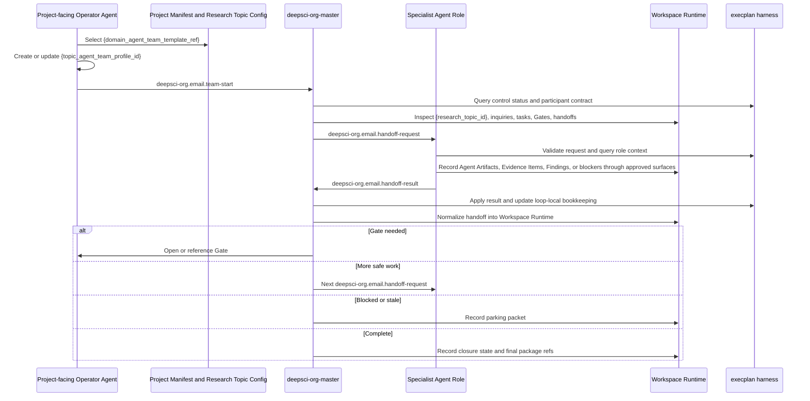

# Collaboration Overview: deepsci-org

## Purpose

This generated process model is the process-first authority for the `deepsci-org` Domain Agent Team Template execplan. It derives from `../../intention/` and keeps all concrete topic, Project, credential, provider, mailbox, gateway, launch, and runtime choices configurable for a later Topic Agent Team Profile.

## Process Posture

- Isomer layer: Domain Agent Team Template.
- Topic specialization: required before launch through `{topic_agent_team_profile_id}`.
- Runtime team: created only as `{agent_team_instance_id}` from the approved Topic Agent Team Profile.
- Topology mode: `tree-loop`.
- Internal root role: `deepsci-org-master`.
- First-launch execution mode: `manual`; automatic mode is valid only when `{scheduler_policy_ref}`, `{gate_policy_ref}`, role-scoped Capability Binding refs, Skill Binding projection refs, and Completion Watcher Contracts are configured for the topic.
- Communication default: Houmao mail with schema-typed rendered Markdown for participant handoffs.
- Runtime state authority for real research: `{workspace_runtime_ref}` inside `{topic_workspace_ref}`, not this authoring package.

## Phase Model

1. Template selection: the Project-facing Operator Agent or Execution Adapter selects `{domain_agent_team_template_ref}` from the Project Manifest or another approved selector.
2. Topic profile specialization: `{topic_agent_team_profile_id}` replaces template placeholders with topic refs, selected roles, stage tuning, Coordination Policy, expected Artifacts, Gate policy refs, Scheduler policy refs, Capability Binding refs, Skill Binding projection refs, provider binding refs, and allowed Research Operation Extension Point refs.
3. Agent Team Instance launch: `{agent_team_instance_id}` creates concrete Agent Instances and Agent Workspaces from the approved profile.
4. Team start: the Operator Agent starts a bounded Run by sending `deepsci-org.email.team-start` to `deepsci-org-master`.
5. Master routing: `deepsci-org-master` inspects Effective Topic Context, Workspace Runtime refs, Gate posture, and prior handoffs, then dispatches one bounded Research Task through `deepsci-org.email.handoff-request`.
6. Specialist pass: the selected specialist processes one handoff, uses its Skill Binding projection, records Agent Artifacts and evidence refs through approved Isomer surfaces, then replies with `deepsci-org.email.handoff-result`.
7. Master normalization: `deepsci-org-master` records the handoff result through the generated state helper and through Isomer Workspace Runtime integration when available, then chooses the next stage, opens a Gate, parks, or closes.
8. Parking or closure: the master parks when blocked, stale, contradictory, missing governed policy, or awaiting a Gate; the master closes only after supported claims, limitations, recommendations, and final package posture are consolidated.

## Event Families

| Event Family | Schema ID | Normal Sender | Normal Receiver | State Effect |
| --- | --- | --- | --- | --- |
| Team start | `deepsci-org.email.team-start` | Project-facing Operator Agent or maintained Houmao messaging surface | `deepsci-org-master` | Opens or resumes one Run and records initial control context. |
| Handoff request | `deepsci-org.email.handoff-request` | `deepsci-org-master` | One specialist role | Records one bounded handoff with expected outputs, Gate constraints, and watcher refs. |
| Handoff result | `deepsci-org.email.handoff-result` | Specialist role | `deepsci-org-master` | Records result refs, evidence posture, claim updates, caveats, and recommended next route. |
| Operator intent | Freeform or generated operator control command | Project-facing Operator Agent | `deepsci-org-master` or harness | Records pause, resume, stop, mode switch, redirect, Gate outcome, or recovery request. |

## Pseudocode Authority

```python
def instantiate_topic_profile(template, effective_topic_context):
    # The Domain Agent Team Template never launches directly.
    assert template.isomer_template_layer == "domain_agent_team_template"
    profile = TopicAgentTeamProfile.from_template(template)
    profile.replace_placeholders(effective_topic_context.topic_refs)
    profile.select_roles(default_roles=template.roles)
    profile.bind_capabilities(effective_topic_context.capability_binding_refs)
    profile.bind_skills(effective_topic_context.skill_binding_projection_refs)
    profile.attach_policies(
        gate_policy_ref=effective_topic_context.gate_policy_ref,
        scheduler_policy_ref=effective_topic_context.scheduler_policy_ref,
        baseline_waiver_policy_ref=effective_topic_context.baseline_waiver_policy_ref,
    )
    # Topic review can remove, tune, or fan out roles before runtime.
    return profile


def start_team_run(agent_team_instance, team_start_mail):
    # This function models one notifier-prompted turn, not a daemon loop.
    assert team_start_mail.schema_id == "deepsci-org.email.team-start"
    state = harness.state_init_or_resume(team_start_mail.run_id)
    state.record_team_start(team_start_mail.payload)
    master = agent_team_instance.role("deepsci-org-master")
    return master_on_tick(master, state)


def master_on_tick(master, state):
    # On-tick performs one bounded scheduling pass and then stops.
    control = harness.control_status(state.run_id)
    if control.run_state in {"paused", "stopped", "completed"}:
        return stop_turn("run control blocks normal progress")
    if state.requires_gate():
        harness.record_operator_intent("gate_required", state.pending_gate_ref)
        return stop_turn("open or await Gate")
    if state.can_close():
        harness.record_closure_packet(state.run_id)
        return stop_turn("closed")
    handoff = choose_next_handoff(state)
    if handoff is None:
        harness.record_parking_packet(state.run_id, reason="no safe next handoff")
        return stop_turn("parked")
    rendered_mail = harness.email_render("handoff_request", handoff.payload)
    # Delivery is owned by maintained Houmao mail or messaging skills.
    return send_via_maintained_mail(rendered_mail)


def specialist_on_handoff_request(role, handoff_mail):
    # A specialist processes one bounded handoff and returns a local-close result to the master.
    assert handoff_mail.schema_id == "deepsci-org.email.handoff-request"
    assert handoff_mail.receiver_role == role.name
    task_context = harness.query_handoff_context(handoff_mail.handoff_id)
    result = role.run_projected_skill(task_context)
    result_payload = build_handoff_result(
        handoff_id=handoff_mail.handoff_id,
        sender_role=role.name,
        receiver_role="deepsci-org-master",
        artifact_refs=result.artifact_refs,
        evidence_item_refs=result.evidence_item_refs,
        research_claim_refs=result.research_claim_refs,
        caveats=result.caveats,
        recommended_next_stage=result.recommended_next_stage,
    )
    return harness.email_render("handoff_result", result_payload)


def master_on_handoff_result(master, result_mail):
    # The master normalizes specialist output and decides the next bounded action.
    assert result_mail.schema_id == "deepsci-org.email.handoff-result"
    assert result_mail.receiver_role == "deepsci-org-master"
    harness.apply_handoff_result(result_mail.payload)
    workspace_runtime.record_handoff_result(result_mail.payload)
    return master_on_tick(master, harness.state_for(result_mail.run_id))
```

## Sequence Diagram



## Recovery Posture

Recovery starts from durable refs, not chat memory. `deepsci-org-master` queries the generated harness state, Workspace Runtime refs, open Gates, latest handoff status, and Agent Team Instance liveness facts from maintained Houmao inspection surfaces. It resumes by processing one bounded mail event or one operator-controlled tick, then stops.

## Terminal Posture

Terminal states are `completed`, `parked`, or `stopped`. A completed Run has a closure packet with supported Research Claims, limitations, recommendations, final Artifacts or `{final_package_ref}`, and any required final Gate outcome. A parked Run has a resume packet with blocker reason, last stable refs, pending Gate or policy gaps, and the next safe operator action. A stopped Run records operator intent and does not imply scientific completion.
